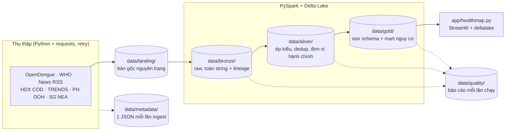

# OutbreakSignal DE - Dengue Early Warning

Hệ thống thu thập và xử lý dữ liệu cảnh báo sớm dịch sốt xuất huyết ở **11 nước Đông Nam Á**.
Nhóm Microwave - AIO 2026, Module 4 (*Data Sources and Data Ingestion using PySpark*).

> **Nhánh `feat/silver-gold`** là nhánh **thử độ khả thi**: ngoài Bronze, nhánh này có Silver,
> Gold (star schema) và app HealthMap (Streamlit), dùng để kiểm tra Bronze bằng một người tiêu
> thụ thật trước khi bàn giao. Tài liệu:
> - [docs/bronze-fixes.md](docs/bronze-fixes.md): lỗi Bronze phát hiện được và cách sửa;
> - [docs/silver-handover.md](docs/silver-handover.md): bàn giao Silver/Gold;
> - [docs/silver-gold-healthmap.md](docs/silver-gold-healthmap.md): danh sách bảng và quy tắc.

## Chạy nhanh

Cần Java 17 và Python 3.11/3.12. Windows cần thêm winutils, xem [mục 7](#7-cài-đặt). Trên
Windows dùng **PowerShell**, không dùng Git Bash.

```powershell
git clone https://github.com/AIVIETNAM-AIO-PhamTien/outbreak-signal-de.git ; cd outbreak-signal-de
py -3.11 -m venv .venv
.venv\Scripts\pip install -r requirements.txt
.venv\Scripts\python.exe scripts\run_batch.py        # 1. ingest mọi nguồn: Landing → Bronze
.venv\Scripts\python.exe scripts\run_transform.py    # 2. Silver + Gold + báo cáo chất lượng (~6 phút)
.venv\Scripts\streamlit.exe run app\healthmap.py     # 3. app HealthMap: http://localhost:8501
```
```bash
# Linux / macOS
python3.11 -m venv .venv && .venv/bin/pip install -r requirements.txt
.venv/bin/python scripts/run_batch.py
.venv/bin/python scripts/run_transform.py
.venv/bin/streamlit run app/healthmap.py
```

`data/` được gitignore, không có sẵn trong repo; ai clone về cũng tự chạy để sinh dữ liệu. Lần
chạy transform đầu tiên tải ranh giới tỉnh Natural Earth (~40MB) về `data/reference/`.

## 1. Mục tiêu

Phát hiện sớm những khu vực có nguy cơ bùng phát sốt xuất huyết, theo kiểu **HealthMap**: kết
hợp tín hiệu tin tức (nhanh, nhưng không có số liệu) với baseline mùa vụ tính từ số ca chính
thức (chính xác, nhưng trễ). Đây là thống kê mô tả, không phải mô hình dự báo.

| Tầng | Việc | Trạng thái |
|---|---|---|
| Landing → Bronze | Thu thập, giữ nguyên trạng, Delta Lake | Hoàn thiện, đã sửa theo [bronze-fixes.md](docs/bronze-fixes.md) |
| Silver | Ép kiểu, dedup, quy về đơn vị hành chính, gắn tin vào nước/tỉnh | Bản thử độ khả thi |
| Gold | Star schema + mart nguy cơ cấp nước và cấp tỉnh | Bản thử độ khả thi |
| App | Streamlit: bản đồ nguy cơ, tầng tỉnh, tin tức, chuỗi thời gian, chất lượng dữ liệu | Bản thử độ khả thi |

## 2. Nguồn dữ liệu

Chỉ dùng nguồn có API, RSS hoặc file phát hành chính thức. **Không scrape HTML/PDF, không dùng
dữ liệu giả lập.**

| Nguồn (bảng Bronze) | Nội dung | Định dạng | Lịch | Vai trò |
|---|---|---|---|---|
| **[OpenDengue](https://opendengue.org/data.html)** (`opendengue`) | Số ca cấp quốc gia + tỉnh (`Spatial_extract`), lọc 11 nước | CSV trong zip | kiểm tra hằng ngày | Lịch sử dài (1960→), nhưng trễ ~17 tháng |
| **[WHO GHO](https://xmart-api-public.who.int/ARBOV/V_DENGUE_GLOBAL_VALIDATED_PUBLIC)** (`who_gho`) | Số ca cấp quốc gia, 9/11 nước (không có PHL, BRN) | JSON (OData) | hằng ngày | Số ca **gần đây** (trễ ~5 tuần) |
| **[Google News RSS](https://news.google.com/rss)** (`news_rss`) | 11 feed theo nước, ngôn ngữ bản xứ, 7 ngày gần nhất | XML | 30 phút | Tín hiệu sớm |
| **[HDX COD-AB](https://data.humdata.org/)** (`hdx_cod_ab`) | Đơn vị hành chính (P-code, tên, toạ độ tâm), 9 nước | XLSX | hằng tuần | Khoá cấp tỉnh |
| **HDX COD-PS** (`hdx_cod_ps`) | Dân số theo đơn vị hành chính | CSV | hằng tuần | Ca / 100.000 dân |
| **[TRENDS](https://zenodo.org/)** (`trends_th_*`) | Thái Lan, tuần × 77 tỉnh, 2016–2025 | XLSX (Zenodo) | hằng tuần | Số ca cấp tỉnh gần đây |
| **PH DOH** (`ph_doh`) | Philippines, tuần × tỉnh, tới 12/2020 | CSV (HDX) | hằng tuần | Số ca cấp tỉnh (lịch sử) |
| **[Singapore NEA](https://data.gov.sg/)** (`sg_nea`) | Cụm dịch đang hoạt động (polygon) | GeoJSON | hằng ngày | Vị trí cụm dịch |

**Vì sao cần cả OpenDengue lẫn WHO GHO:** hai nguồn không thay thế được nhau.
- OpenDengue có lịch sử dài và phủ đủ 11 nước.
- WHO GHO mới hơn nhiều, nhưng thiếu Philippines và Brunei.

Gold ghép hai nguồn thành một chuỗi baseline chung. Trên 162 tháng cả hai nguồn cùng có số liệu,
độ lệch trung vị là 0%.

## 3. Kiến trúc

<p align="center"></p>

*Hình: luồng ingest Landing → Bronze, vẽ khi mới có các nguồn đầu tiên. Sơ đồ đầy đủ ở dưới.*



- **Tách thu thập và Spark thành 2 bước** vì Spark không gọi được API; Spark chỉ đọc file có sẵn
  trên đĩa. Python thuần tải dữ liệu về `data/landing/` trước, sau đó Spark mới đọc.
- **Transform Silver/Gold viết bằng PySpark thuần**, không dùng Python UDF. Mỗi transform là một
  hàm `DataFrame → DataFrame`; chỉ `scripts/run_transform.py` đọc và ghi.
- **App đọc Gold bằng `deltalake`**, không cần JVM.

## 4. Nguyên tắc tầng Bronze

Bronze **giữ nguyên trạng dữ liệu nguồn**:
- không đổi tên cột, không xoá trùng, không join, không suy ra trường mới;
- mọi cột đọc dưới dạng **string**. Ép kiểu là việc của Silver.

Lý do đọc toàn string: để Spark tự suy kiểu thì cột đang toàn null (ví dụ `POPULATION` của WHO)
sẽ bị suy thành string. Hôm nào cột đó có số, kiểu đổi, và bước ghi Delta sẽ vỡ.

Bronze chỉ thêm các cột truy vết sau:

| Cột | Ý nghĩa |
|---|---|
| `_source` | Tên nguồn |
| `_ingested_at` | Thời điểm ghi Delta (UTC). Bị ghi lại khi dựng lại partition |
| `_fetched_at` | Thời điểm **gọi API**, ghi ngay trong file landing (news, WHO, SG NEA). Không bị ghi đè |
| `_source_file` | File landing mà dòng này đến từ đó, tính từ thư mục `landing/` |
| cột phân vùng | `ingestion_date` (nguồn theo ngày) hoặc phiên bản (`release`, `_version`, `_release`) |

Nguồn phát hành theo phiên bản còn thêm dấu vân tay file (`_file_sha`, `_file_md5`) để biết đã
nạp phiên bản đó chưa.

**Hai bản dữ liệu, hai vai trò:**
- `data/landing/` là bản **gốc byte-for-byte**, không bao giờ bị sửa. Đây là source of truth.
- `data/bronze/` là bản **Delta** để Spark query được.

### 4.1 Idempotency

| Kiểu nguồn | Nguồn | Cách làm |
|---|---|---|
| Theo ngày | `news_rss`, `who_gho`, `sg_nea` | Dựng lại partition ngày từ mọi file landing của ngày đó, ghi đè bằng `replaceWhere`. Chạy lại không nhân đôi |
| Theo phiên bản | `opendengue`, `hdx_*`, `trends_th`, `ph_doh` | Partition theo phiên bản. Phiên bản + dấu vân tay đã có trong Bronze thì **bỏ qua** (SKIPPED), không tải lại |

Với tin tức, mỗi lần fetch là một quan sát riêng nên số dòng tăng dần; đó là chủ ý. Việc gộp
bài trùng thuộc về Silver.

### 4.2 Ngoại lệ: lọc phạm vi ở Bronze

`opendengue` và `hdx_cod_ps` **lọc dòng** về 11 nước trước khi ghi Bronze.
- **Lý do:** `Spatial_extract` có 2.821.799 dòng toàn cầu, phần Đông Nam Á chỉ chiếm 2,5%
  (70.557 dòng).
- **Giới hạn của ngoại lệ:**
  - `data/landing/` vẫn giữ 100% file gốc.
  - Bộ lọc chỉ chọn dòng *nào* được thu thập, không sửa giá trị của dòng nào. Về bản chất, nó
    gần với tham số `$filter` khi gọi API của WHO hơn là một phép biến đổi.
- **Vì sao dùng `Spatial_extract`:** `National_extract` không có cấp tỉnh (`adm_1_name` luôn
  là `"NA"`).

## 5. Silver, Gold và app

Chi tiết từng bảng xem [docs/silver-gold-healthmap.md](docs/silver-gold-healthmap.md). Các bước
và lý do đằng sau xem [docs/silver-handover.md](docs/silver-handover.md).

- **Silver:**
  - `dengue_cases`, `news_articles`;
  - `admin_units` (SCD2: Việt Nam sáp nhập 63 → 34 tỉnh từ 01/07/2025), `admin_crosswalk`;
  - `unit_population`, `province_cases`, `news_unit_mentions`.
- **Gold:**
  - `dim_country`, `dim_date`, `dim_admin_unit`;
  - `fact_monthly_cases`, `fact_unit_monthly_cases`, `fact_daily_news`, `fact_unit_daily_news`;
  - mart `country_risk` và `unit_risk` (z-score so với cùng tháng của tối đa 5 năm trước).
- **Báo cáo chất lượng:** mỗi lần chạy ghi `data/quality/quality_<run_id>.md`. Có ERROR thì exit
  code là 1.
- **App:** 4 tab.
  1. Bản đồ nguy cơ, có tầng cấp tỉnh.
  2. Tin tức.
  3. Chuỗi thời gian theo nước.
  4. Chất lượng dữ liệu.

```powershell
.venv\Scripts\python.exe scripts\run_transform.py --layer silver   # hoặc gold, mặc định chạy cả hai
```

Sau mỗi lần chạy lại transform, khởi động lại app, vì app cache dữ liệu Gold.

**Kết quả thử độ khả thi (29–30/09/2026):**
- **Cấp nước:** khả thi với 9/11 nước, vì WHO có số ca gần đây và baseline. PHL và BRN chỉ
  có OpenDengue, lần lượt tới 10/2023 và 04/2017.
- **Cấp tỉnh theo số ca:** mới chỉ có Thái Lan có số liệu gần đây. Các nước khác chỉ có số liệu
  cũ (VN, KHM, LAO tới 2010; PHL tới 2020).
- **Cấp tỉnh theo tin tức:** hiện chỉ khoảng 11% số bài gắn được tới tỉnh.

## 6. Cấu trúc thư mục

```
.
├── configs/sources.yaml           # mọi endpoint / lịch / bật-tắt nguồn
├── ingestion/
│   ├── common/                    # spark_session, config, paths, logging, metadata,
│   │                              # validation, bronze, http (retry), hdx, excel
│   ├── opendengue.py  news_rss.py  who_gho.py
│   ├── hdx_cod.py                 # hdx_cod_ab + hdx_cod_ps
│   ├── trends_th.py  ph_doh.py  sg_nea.py
├── transform/
│   ├── common.py                  # đường dẫn, đọc/ghi Delta, small_frame, QualityReport
│   ├── reference.py               # 11 nước: iso3, tên theo từng nguồn, từ khoá tin tức
│   ├── boundaries.py  geo.py      # ranh giới Natural Earth + điểm-trong-polygon (PySpark)
│   ├── names.py                   # so khớp tên địa danh (translate + levenshtein)
│   ├── checks.py                  # mọi kiểm tra chất lượng Bronze/Silver/Gold
│   ├── silver/                    # cases, news, admin, province
│   └── gold/                      # dims, facts, risk, units
├── app/                           # healthmap.py (Streamlit), gold_reader.py
├── scripts/
│   ├── run_batch.py               # ingest — điểm vào của Bronze
│   ├── run_transform.py           # Silver + Gold + báo cáo chất lượng
│   ├── check_bronze.py            # đọc lại Bronze để kiểm tra
│   └── smoke_test.py              # kiểm tra Spark + Delta + Java
├── tests/
├── docs/
│   ├── bronze-layer-report.md     # report kỹ thuật tầng Bronze
│   ├── bronze-fixes.md            # lỗi Bronze phát hiện khi dựng Silver/Gold
│   ├── silver-handover.md         # bàn giao Silver/Gold
│   ├── silver-gold-healthmap.md   # danh sách bảng, quy tắc, giới hạn
│   └── handout-silver-layer.md    # data dictionary Bronze cho người làm Silver
├── spikes/  notebooks/  assets/
├── data/                          # gitignored — tự sinh khi chạy
│   ├── landing/ bronze/ silver/ gold/ quality/ reference/ metadata/
├── logs/                          # gitignored
└── .hadoop/bin/                   # gitignored, chỉ Windows — xem Bước 3
```

## 7. Cài đặt

| Thành phần | Phiên bản | Ghi chú |
|---|---|---|
| Java | OpenJDK **17** | PySpark cần JRE kể cả khi chạy local mode |
| Python | **3.11** hoặc 3.12 | xem [Lưu ý về phiên bản](#lưu-ý-về-phiên-bản) |
| pyspark | **3.5.9** | bản cũ hơn crash trên Windows, xem phần Lưu ý |
| winutils | chỉ **Windows** | xem Bước 3 |

> ⚠️ **Trên Windows: dùng PowerShell, KHÔNG dùng Git Bash.** Git Bash trộn lẫn dấu gạch xuôi
> và gạch ngược khi truyền `PATH` sang JVM, khiến Spark báo lỗi `UnsatisfiedLinkError:
> NativeIO$Windows.access0` rất khó hiểu.

### Bước 1 — Java 17

```powershell
java -version          # phải ra 17.x
winget install Microsoft.OpenJDK.17   # nếu chưa có (Windows)
```
```bash
sudo apt install openjdk-17-jdk       # Ubuntu/Debian
brew install openjdk@17               # macOS
```

### Bước 2 — Virtual environment

```powershell
py -3.11 -m venv .venv
.venv\Scripts\pip install -r requirements.txt
```
```bash
python3.11 -m venv .venv
.venv/bin/pip install -r requirements.txt
```

### Bước 3 — winutils (CHỈ Windows)

> **Linux / macOS: bỏ qua bước này.**

Spark trên Windows cần `winutils.exe` và `hadoop.dll` để thao tác quyền file, **kể cả khi chỉ
ghi ra ổ đĩa local**. Thiếu hai file này sẽ gặp lỗi `HADOOP_HOME and hadoop.home.dir are unset`.

```powershell
New-Item -ItemType Directory -Force .hadoop\bin | Out-Null
$base = "https://raw.githubusercontent.com/cdarlint/winutils/master/hadoop-3.3.6/bin"
Invoke-WebRequest "$base/winutils.exe" -OutFile ".hadoop\bin\winutils.exe"
Invoke-WebRequest "$base/hadoop.dll"   -OutFile ".hadoop\bin\hadoop.dll"
```

- **Không cần set `HADOOP_HOME` thủ công:** `ingestion/common/spark_session.py` tự trỏ vào
  `.hadoop/`.
- **Dùng đúng bản hadoop-3.3.6:** bản 3.3.5 đòi thêm Visual C++ 2010 Redistributable.
- **`.hadoop/` bị gitignore có chủ đích:** đây là binary do bên thứ ba build. Apache chưa có bản
  build Windows chính thức ([HADOOP-18135](https://issues.apache.org/jira/browse/HADOOP-18135)).

### Bước 4 — Kiểm tra cài đặt

```powershell
$env:PYTHONPATH = (Get-Location).Path
.venv\Scripts\python.exe scripts\smoke_test.py
```
```bash
PYTHONPATH=$(pwd) .venv/bin/python scripts/smoke_test.py
```

Cài đặt thành công khi thấy bảng 3 dòng `ok` và dòng `Smoke test OK`.

## 8. Chạy ingestion

```powershell
.venv\Scripts\python.exe scripts\run_batch.py                          # mọi nguồn đang bật
.venv\Scripts\python.exe scripts\run_batch.py --source news_rss        # một nguồn
.venv\Scripts\python.exe scripts\check_bronze.py                       # đọc lại Bronze
```

- Muốn chạy nhiều nguồn trong một lệnh, lặp lại `--source`.
- Muốn tắt một nguồn, đặt `enabled: false` trong `configs/sources.yaml`; **không sửa code**.
- **Mỗi nguồn chạy độc lập:** một nguồn lỗi không kéo theo nguồn khác.
- Trong một nguồn tin tức, mỗi feed cũng chạy độc lập.
- Exit code là 1 nếu có nguồn `FAILED`. `SKIPPED` (không có phiên bản mới) không tính là lỗi.

Bronze sau khi chạy thật (29/09/2026):

| Bảng | Số dòng | Số cột | Phân vùng |
|---|---|---|---|
| `opendengue` | 70.557 (đã lọc 11 nước) | 23 | `release` |
| `who_gho` | 1.232 (9/11 nước) | 21 | `ingestion_date` |
| `news_rss` | 514 (456 bài khác nhau) | 17 | `ingestion_date` |
| `hdx_cod_ab` / `hdx_cod_ab_geometry` | 680 / 34 | 57 / 11 | `iso3` |
| `hdx_cod_ps` | 14.200 | 84 | `_resource` |
| `trends_th_weekly` / `trends_th_province` | 40.579 / 77 | 24 / 22 | `_release` |
| `ph_doh` | 32.701 | 10 | `_version` |
| `sg_nea` | 11 cụm | 19 | `ingestion_date` |

### Lên lịch (Windows Task Scheduler)

| Task | Lệnh | Tần suất |
|---|---|---|
| News | `run_batch.py --source news_rss` | 30 phút |
| Nguồn theo ngày | `run_batch.py --source opendengue --source who_gho --source sg_nea` | 1 lần/ngày |
| Nguồn theo tuần | `run_batch.py --source hdx_cod_ab --source hdx_cod_ps --source trends_th --source ph_doh` | 1 lần/tuần |
| Transform | `run_transform.py` | sau mỗi lần ingest |

## 9. Metadata mỗi lần chạy

Mỗi lần chạy, **thành công, thất bại hay bỏ qua**, đều để lại một file
`data/metadata/<nguồn>/ingestion_date=<ngày>/<run_id>.json`:

```json
{
  "source": "opendengue",
  "source_url": "https://github.com/OpenDengue/master-repo/raw/main/data/releases/V1.3/Spatial_extract_V1_3.zip",
  "ingestion_date": "2026-09-29",
  "run_id": "20260929T042610Z",
  "status": "success",
  "record_count": 70557,
  "raw_files": [{"path": "...", "bytes": 54687820, "sha256": "..."}],
  "source_version": "V1.3",
  "duration_seconds": 35.56,
  "error_message": null,
  "warnings": []
}
```

- **`warnings`** ghi những vấn đề không làm hỏng lần chạy, ví dụ một feed lỗi, một feed chạm
  trần 100 bài, hoặc lý do SKIPPED.
- **Metadata mô tả thao tác ingestion.** Các cột `_source`, `_fetched_at`… trong bảng là lineage
  ở mức **từng dòng**. Cần cả hai.

## 10. Hạn chế đã biết về nguồn

| Nguồn | Hạn chế |
|---|---|
| **WHO GHO** | Không có Philippines, Brunei (nguồn thật sự không có, không phải lỗi filter). Có 5 dòng kỳ ở tương lai (2027–2029) và tháng gần nhất có thể chưa báo cáo đủ (IDN, TLS). Khoá dòng là `(ISO3, YEAR, DATE_TYPE, DATE_NUM)` |
| **OpenDengue** | Phát hành theo phiên bản (V1.3, số liệu tới 04/2025). Số liệu cấp tỉnh của VN, PHL, KHM, LAO chỉ tới 2010. `RNE_iso_code` của PHL sai trên diện rộng. `UUID` là mã tài liệu, không phải khoá dòng |
| **Google News RSS** | Không có trường địa điểm; nước và tỉnh được suy ra ở Silver. Hiện 89% bài gắn được nước, ~11% gắn được tỉnh. Locale km, lo, my trả 0 bài nên KH, LA, MM dùng tiếng Anh |
| **HDX COD** | Không có Singapore, Brunei. Indonesia vẫn là bản 2020 (34 tỉnh). Việt Nam chỉ có 34 tỉnh mới; 63 tỉnh cũ lấy từ Natural Earth |
| **Malaysia iDengue** | Không dùng: không có API, chỉ scrape được |
| **GDELT DOC 2.0** | Tắt (`enabled: false`): bị `HTTP 429` từ mạng dùng chung. Đã thay bằng Google News RSS |
| **ProMED, HealthMap** | Không dùng: không có cơ chế truy cập công khai phù hợp |

Các vấn đề dữ liệu cùng cách Silver xử lý: [docs/bronze-fixes.md](docs/bronze-fixes.md), mục C.

## 11. Chạy test

```powershell
.venv\Scripts\python.exe -m pytest -q                         # toàn bộ (~5 phút trên Windows)
.venv\Scripts\python.exe -m pytest -m "not integration"       # bỏ qua test cần JVM
```

| Nhóm test | Nội dung |
|---|---|
| `test_config`, `test_paths`, `test_metadata`, `test_validation`, `test_who_gho` | Hạ tầng ingestion |
| `test_ingestion_units` | Parse RSS, chọn release OpenDengue, HDX, TRENDS, SG NEA, retry HTTP |
| `test_integration_bronze`, `test_integration_who_gho` | Chuỗi nguồn → ingestion → Bronze → metadata, chạy thật Spark + Delta |
| `test_transform_reference`, `test_silver_cases`, `test_silver_news` | Silver: ép kiểu, cờ chất lượng, dedup, gắn nước |
| `test_silver_admin`, `test_geo`, `test_province` | Đơn vị hành chính, điểm-trong-polygon, nối số ca / tin vào tỉnh |
| `test_gold` | Chọn chuỗi không cộng trùng, z-score, baseline hợp nhất, độ trễ báo cáo, so khớp tên |
| `test_app` | Chạy app trên Gold nhỏ bằng `streamlit.testing` |

## 12. Ngoài phạm vi

Machine learning, dự báo bùng phát, NLP/trích xuất thực thể bằng mô hình, Kafka, streaming,
Airflow, dbt, Dagster, Snowflake, LLM, vector database.

Silver, Gold và app ở nhánh này là **bản thử độ khả thi**, chưa được nhóm review theo quy trình
chính thức.

## Lưu ý về phiên bản

**`pyspark` phải là 3.5.9.** Các bản 3.5.x trước đó dính
[SPARK-53759](https://issues.apache.org/jira/browse/SPARK-53759): `createDataFrame()` làm Python
worker crash. Bug này chỉ xảy ra trên Windows + Python 3.12/3.13 + local mode.

**Cảnh báo vô hại trong log:**
- *Windows*, cuối mỗi job: `ERROR ShutdownHookManager: Exception while deleting Spark temp dir:
  ... antlr4-runtime.jar`. Nguyên nhân là Windows còn giữ khoá file `.jar` lúc JVM tắt. Không
  ảnh hưởng dữ liệu; cứ nhìn exit code và bảng tổng kết.
- *Linux / macOS*, đầu mỗi job: `WARN NativeCodeLoader: Unable to load native-hadoop library`.
  Không có thư viện native thì Spark dùng bản Java thuần.
