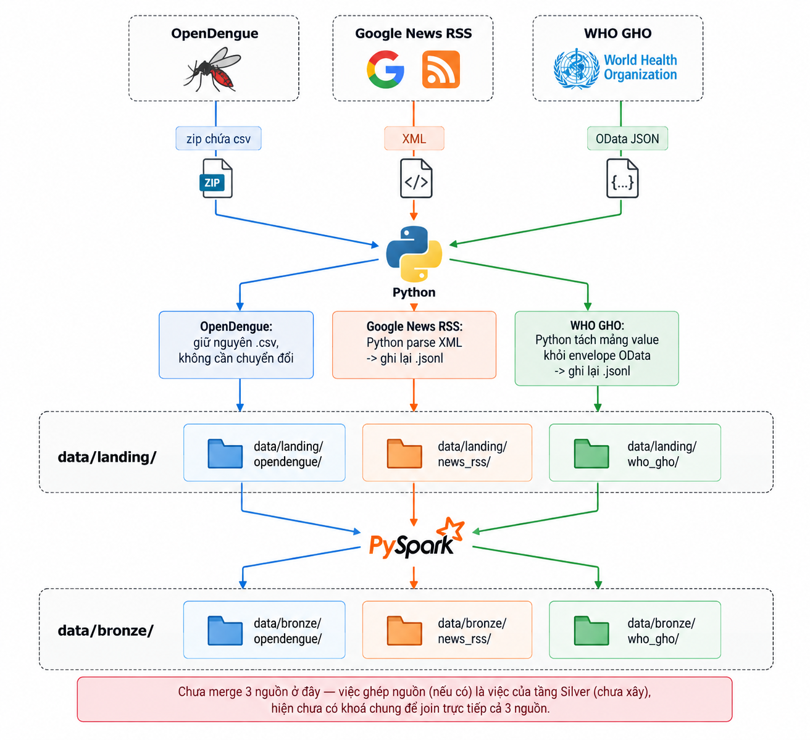
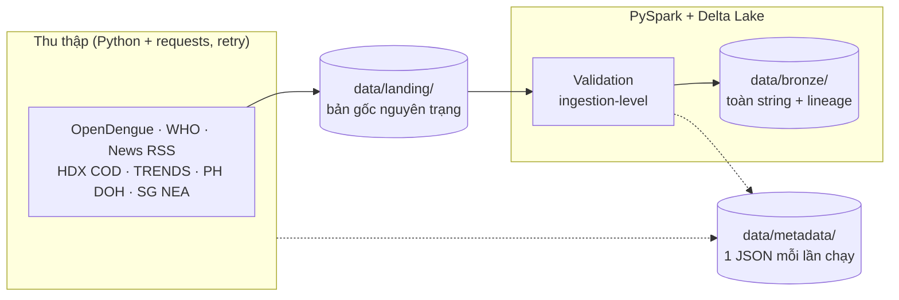

# OutbreakSignal DE - Dengue Early Warning (Bronze + Silver)

Hệ thống thu thập và lưu trữ dữ liệu cảnh báo sớm dịch sốt xuất huyết ở **11 nước Đông Nam Á**.
Nhóm Microwave - AIO 2026, Module 4 (*Data Sources and Data Ingestion using PySpark*).

> Tài liệu kèm theo:
> - [docs/handout-silver-layer.md](docs/handout-silver-layer.md): data dictionary mọi bảng
>   Bronze, dành cho người làm Silver;
> - [docs/bronze-fixes.md](docs/bronze-fixes.md): lỗi Bronze phát hiện khi thử dựng Silver/Gold
>   (nhánh `feat/silver-gold`) và cách đã sửa.

## Chạy nhanh

Cần Java 17 và Python 3.11/3.12. Windows cần thêm winutils, xem [mục 6](#6-cài-đặt). Trên
Windows dùng **PowerShell**, không dùng Git Bash.

```powershell
git clone https://github.com/AIVIETNAM-AIO-PhamTien/outbreak-signal-de.git ; cd outbreak-signal-de
py -3.11 -m venv .venv
.venv\Scripts\pip install -r requirements.txt
.venv\Scripts\python.exe scripts\run_batch.py        # ingest mọi nguồn: Landing → Bronze
.venv\Scripts\python.exe scripts\check_bronze.py     # đọc lại Bronze để kiểm tra
.venv\Scripts\python.exe scripts\run_silver.py       # dựng các bảng Silver
```
```bash
# Linux / macOS
python3.11 -m venv .venv && .venv/bin/pip install -r requirements.txt
.venv/bin/python scripts/run_batch.py
.venv/bin/python scripts/check_bronze.py
.venv/bin/python scripts/run_silver.py
```

`data/` được gitignore, không có sẵn trong repo; ai clone về cũng tự chạy để sinh dữ liệu.

## 1. Mục tiêu

Phát hiện sớm những khu vực có nguy cơ bùng phát sốt xuất huyết, theo kiểu **HealthMap**: kết
hợp tín hiệu tin tức (nhanh, nhưng không có số liệu) với baseline mùa vụ tính từ số ca chính
thức (chính xác, nhưng trễ). Đây là thống kê mô tả, không phải mô hình dự báo.

Repo triển khai tầng **Bronze** cho các nguồn và ba bảng **Silver**: `dengue_history` từ
OpenDengue + WHO GHO (quốc gia và cấp 1, không chồng kỳ trong cùng địa điểm), và
`administrative_boundaries` từ HDX COD-AB (danh mục quốc gia/cấp 1 với điểm đại diện),
và `news` từ Google News RSS.
Các nguồn khác, Gold và app thử độ khả thi nằm ở nhánh `feat/silver-gold`.

## 2. Nguồn dữ liệu

Chỉ dùng nguồn có API, RSS hoặc file phát hành chính thức. **Không scrape HTML/PDF, không dùng
dữ liệu giả lập.**

| Nguồn (bảng Bronze) | Nội dung | Định dạng | Lịch | Vai trò |
|---|---|---|---|---|
| **[OpenDengue](https://opendengue.org/data.html)** (`opendengue`) | Số ca cấp quốc gia + tỉnh (`Spatial_extract`), lọc 11 nước | CSV trong zip | kiểm tra hằng ngày | Lịch sử dài (1960→), nhưng trễ ~17 tháng |
| **[WHO GHO](https://xmart-api-public.who.int/ARBOV/V_DENGUE_GLOBAL_VALIDATED_PUBLIC)** (`who_gho`) | Số ca cấp quốc gia, 9/11 nước (không có PHL, BRN) | JSON (OData) | hằng ngày | Số ca **gần đây** (trễ ~5 tuần) |
| **[Google News RSS](https://news.google.com/rss)** (`news_rss`) | 11 feed theo nước, ngôn ngữ bản xứ, 7 ngày gần nhất | XML | 30 phút | Tín hiệu sớm |
| **[HDX COD-AB](https://data.humdata.org/)** (`hdx_cod_ab`) | Đơn vị hành chính (P-code, tên, toạ độ tâm), 9/11 nước (không có SGP, BRN) | XLSX | hằng tuần | Khoá cấp tỉnh |
| **[geoBoundaries](https://www.geoboundaries.org/)** (`geoboundaries_adm`) | Ranh giới vá lấp cho nước COD-AB không có — hiện là Brunei, 4 district | GeoJSON | hằng tuần | Lấp lỗ hổng BRN |
| **Bảng nối tỉnh VN** (`vn_province_crosswalk`) | 64 tỉnh cũ → 34 tỉnh mới (NQ 202/2025/QH15 + Hà Tây 2008) | CSV (seed trong repo) | hằng tuần | Bắt buộc để join cấp tỉnh VN |
| **HDX COD-PS** (`hdx_cod_ps`) | Dân số theo đơn vị hành chính | CSV | hằng tuần | Ca / 100.000 dân |
| **[TRENDS](https://zenodo.org/)** (`trends_th_*`) | Thái Lan, tuần × 77 tỉnh, 2016–2025 | XLSX (Zenodo) | hằng tuần | Số ca cấp tỉnh gần đây |
| **PH DOH** (`ph_doh`) | Philippines, tuần × tỉnh, tới 12/2020 | CSV (HDX) | hằng tuần | Số ca cấp tỉnh (lịch sử) |
| **[Singapore NEA](https://data.gov.sg/)** (`sg_nea`) | Cụm dịch đang hoạt động (polygon) | GeoJSON | hằng ngày | Vị trí cụm dịch |

**Vì sao cần cả OpenDengue lẫn WHO GHO:** hai nguồn không thay thế được nhau.
- OpenDengue có lịch sử dài và phủ đủ 11 nước.
- WHO GHO mới hơn nhiều, nhưng thiếu Philippines và Brunei.

`dengue_history` chọn chuỗi cấp quốc gia từ hai nguồn: ưu tiên OpenDengue, chỉ bổ sung WHO ở
kỳ không giao với OpenDengue; đồng thời giữ chuỗi cấp tỉnh (`Admin1`) của OpenDengue.
`_source` trên mỗi dòng cho biết nguồn được chọn.

## 3. Kiến trúc

<p align="center"></p>

*Hình: luồng ingest Landing → Bronze, vẽ khi mới có các nguồn đầu tiên. Sơ đồ đầy đủ ở dưới.*



- **Tách thu thập và Spark thành 2 bước** vì Spark không gọi được API; Spark chỉ đọc file có sẵn
  trên đĩa. Python thuần tải dữ liệu về `data/landing/` trước, sau đó Spark mới đọc.
- **Logic thu thập của từng nguồn tách hẳn khỏi phần Spark**, và dùng chung module HTTP có retry
  (`ingestion/common/http.py`).

## 4. Nguyên tắc tầng Bronze

Bronze **giữ nguyên trạng dữ liệu nguồn**:
- không đổi tên cột, không xoá trùng, không join, không suy ra trường mới;
- mọi cột đọc dưới dạng **string**. Ép kiểu là việc của Silver.

Lý do đọc toàn string: để Spark tự suy kiểu thì cột đang toàn null (ví dụ `POPULATION` của WHO)
sẽ bị suy thành string. Hôm nào cột đó có số, kiểu đổi, và bước ghi Delta sẽ vỡ.

Bronze chỉ thêm các cột truy vết sau:

| Cột | Ý nghĩa |
|---|---|
| `_source` | Tên nguồn |
| `_ingested_at` | Thời điểm ghi Delta (UTC). Bị ghi lại khi dựng lại partition |
| `_fetched_at` | Thời điểm **gọi API**, ghi ngay trong file landing (news, WHO, SG NEA). Không bị ghi đè |
| `_source_file` | File landing mà dòng này đến từ đó, tính từ thư mục `landing/` |
| cột phân vùng | `ingestion_date` (nguồn theo ngày) hoặc phiên bản (`release`, `_version`, `_release`) |

Nguồn phát hành theo phiên bản còn thêm dấu vân tay file (`_file_sha`, `_file_md5`) để biết đã
nạp phiên bản đó chưa.

**Hai bản dữ liệu, hai vai trò:**
- `data/landing/` là bản **gốc byte-for-byte**, không bao giờ bị sửa. Đây là source of truth.
- `data/bronze/` là bản **Delta** để Spark query được.

### 4.1 Idempotency

| Kiểu nguồn | Nguồn | Cách làm |
|---|---|---|
| Theo ngày | `news_rss`, `who_gho`, `sg_nea` | Dựng lại partition ngày từ mọi file landing của ngày đó, ghi đè bằng `replaceWhere`. Chạy lại không nhân đôi |
| Theo phiên bản | `opendengue`, `hdx_*`, `trends_th`, `ph_doh` | Partition theo phiên bản. Phiên bản + dấu vân tay đã có trong Bronze thì **bỏ qua** (SKIPPED), không tải lại |

Với tin tức, mỗi lần fetch là một quan sát riêng nên số dòng tăng dần; đó là chủ ý. Việc gộp
bài trùng thuộc về Silver.

### 4.2 Ngoại lệ: lọc phạm vi ở Bronze

`opendengue` và `hdx_cod_ps` **lọc dòng** về 11 nước trước khi ghi Bronze.
- **Lý do:** `Spatial_extract` có 2.821.799 dòng toàn cầu, phần Đông Nam Á chỉ chiếm 2,5%
  (70.557 dòng).
- **Giới hạn của ngoại lệ:**
  - `data/landing/` vẫn giữ 100% file gốc.
  - Bộ lọc chỉ chọn dòng *nào* được thu thập, không sửa giá trị của dòng nào. Về bản chất, nó
    gần với tham số `$filter` khi gọi API của WHO hơn là một phép biến đổi.
- **Vì sao dùng `Spatial_extract`:** `National_extract` không có cấp tỉnh (`adm_1_name` luôn
  là `"NA"`).

### 4.3 Silver: Bronze OpenDengue + WHO GHO, Silver COD-AB → `dengue_history`

Chạy `.venv/bin/python scripts/run_silver.py` (Windows:
`.venv\Scripts\python.exe scripts\run_silver.py`) sau khi đã có Bronze OpenDengue, WHO GHO và
HDX COD-AB. Job dựng `administrative_boundaries` trước, sau đó chọn release OpenDengue và
snapshot WHO mới nhất, làm sạch mỗi nguồn trong Spark, chọn kỳ và ánh xạ P-code COD-AB trước
khi ghi `data/silver/dengue_history/`. Ngay cả khi chỉ định `--table dengue_history`,
job vẫn làm mới `administrative_boundaries` trước. **Không đọc hoặc ghi `dengue_unified`**.

Bảng có đúng 13 cột: `adm_0_name`, `adm_1_name`, `iso3`, `p_code`, `start_date`, `year`,
`dengue_total`, `s_res`, `t_res`, `_source`, `_source_file`, `_bronze_ingested_at`,
`_silver_ingested_at`. `iso3` lấy từ `ISO_A0` (OpenDengue) hoặc `ISO3` (WHO);
`start_date` là `date`, `year` là
`int`, `dengue_total` là `bigint`, hai cột thời điểm là `timestamp`; các cột còn lại là
`string`.

- Cắt khoảng trắng, đổi `NA`/`N/A`/`NULL`/`NONE` và chuỗi rỗng thành null ở các cột văn bản;
  viết hoa chữ đầu từng từ của `adm_0_name` (vd `VIET NAM` → `Viet Nam`,
  `TIMOR-LESTE` → `Timor-Leste`). `adm_1_name` cũng viết hoa chữ đầu từng từ rồi
  bỏ toàn bộ khoảng trắng (vd `HAI PHONG` → `HaiPhong`), chuẩn hoá ISO3 và nhãn độ phân giải. `t_res` luôn viết
  thường: OpenDengue `Week` → `epiweek`, `Month` → `month`, `Year` → `year`; đây chỉ là
  đổi nhãn theo kỳ Chủ nhật–Thứ bảy, **không dời ngày hoặc phân bổ lại số ca**.
- Bỏ dòng thiếu nước/ISO3/ngày/năm/số ca hoặc lineage bắt buộc; bỏ ngày tương lai, số ca âm,
  giá trị không ép kiểu được và độ phân giải thời gian ngoài `epiweek`/`month`/`year`.
  `adm_1_name` null ở `Admin0`; `Admin1` OpenDengue phải có tên tỉnh.
- Chống trùng theo địa điểm + kỳ + độ phân giải. Nếu nhiều định nghĩa ca cùng grain, ưu tiên
  `Total` → `Suspected and confirmed` → `Confirmed`. Nếu **cùng định nghĩa** nhưng số ca mâu
  thuẫn, job báo lỗi thay vì chọn tuỳ tiện. `UUID` không được dùng làm khoá dòng.
- Schema 13 cột không có `adm_2_name`, nên **không đưa `Admin2` vào chuỗi này**; `Admin1` của
  OpenDengue được giữ, còn WHO chỉ có `Admin0`. Bronze vẫn giữ `Admin2` để thiết kế bảng chi
  tiết khác nếu cần. HDX COD-AB là chuẩn: job dựng `administrative_boundaries` trước, kiểm tra
  cặp ISO3/tên nước của cả OpenDengue lẫn WHO. `adm_0_name` vẫn giữ khoảng trắng;
  `adm_1_name` lưu dạng liền chữ ở cả hai bảng Silver. Khóa so sánh tên không phân biệt
  hoa/thường. `Admin0` ghép theo ISO3; `Admin1` thử khóa `(iso3, adm_1_name)` theo HDX, rồi thử
  công thức RNE `TH-10` → COD `TH10`, `KH-1` → `KH01` cho **chỉ Thái Lan và Campuchia**.
  Công thức phải ra mã thực có trong HDX; tên và mã cho kết quả khác nhau thì job báo lỗi.
  Không có bảng/file alias và không ghép mờ. Nước thiếu HDX và tỉnh Việt Nam lịch sử giữ dòng
  bệnh nhưng để `p_code=NULL`; Admin0 Việt Nam vẫn ghép được mã quốc gia `VN`.
  Không áp công thức chung: OpenDengue `MY-04` là Melaka, còn HDX `MY04` là Kuala Lumpur.

Trên snapshot `V1.3` hiện có: 70.557 dòng Bronze → loại khỏi phạm vi 9.060 dòng `Admin2` →
61.497 dòng OpenDengue đã làm sạch **trong Spark**; các kỳ `Admin0` và `Admin1` đều được cân
nhắc cho `dengue_history`. Job in số dòng lỗi/trùng sau mỗi lần chạy.

WHO GHO đọc **snapshot Bronze theo `ingestion_date` mới nhất** (mỗi ngày là một snapshot đầy
đủ), ánh xạ `COUNTRY` → `adm_0_name`, `ISO3` → `iso3`, `CASES` → `dengue_total`,
`DATE_TYPE` → `t_res` (`month`/`isoweek`/`epiweek`). WHO chỉ có cấp quốc gia nên `s_res=Admin0`,
`adm_1_name` và `p_code` để null. Các dòng thiếu `START_DATE` loại `month` được điền ngày 1
của tháng từ `YEAR` và `DATE_NUM`; **không tự suy ngày cho tuần ISO/epi** vì hai quy ước tuần
khác nhau. Bỏ các dòng có `start_date` trong tương lai, ngày hoặc số ca không hợp lệ; khử trùng
theo `(iso3, year, t_res, DATE_NUM)` và báo lỗi nếu cùng khóa nhưng số ca/ngày mâu thuẫn.

`data/silver/dengue_history/` là bảng **dùng để đọc chuỗi lịch sử quốc gia và tỉnh**.
Mỗi kỳ là khoảng nửa mở `[start_date, ngày_kết_thúc)`: tuần 7 ngày, tháng đến ngày 1 tháng
sau, năm đến ngày 1 năm sau. Trong OpenDengue, khi các kỳ chồng nhau, ưu tiên độ chi tiết
**tuần → tháng → năm**; WHO cũng theo thứ tự đó (tuần ISO trước epiweek nếu giao nhau).
Một kỳ WHO chỉ được lấy khi **không giao với bất kỳ kỳ OpenDengue gốc nào** của cùng nước,
kể cả kỳ OpenDengue bị loại vì chồng với kỳ chi tiết hơn. Với `Admin1`, cũng chọn tuần → tháng
→ năm **trong cùng tỉnh**; kỳ quốc gia và kỳ tỉnh được giữ song song. Không chia nhỏ hay cộng
gộp số ca; `_source` và các cột lineage được giữ để truy vết. Khi tính tổng, **không cộng
`Admin0` và `Admin1` với nhau** vì sẽ đếm trùng. Chuỗi không bảo đảm đủ mọi ngày nếu nguồn vốn
thiếu dữ liệu.
`data/silver/dengue_unified/` có thể còn trên máy từ phiên bản pipeline trước; bản cũ đó
**không được job hiện tại cập nhật hay sử dụng** và chưa bị xóa để giữ khả năng đối chiếu.
Trên snapshot hiện tại: 4.841 kỳ OpenDengue `Admin0` → giữ 4.739; 56.656 kỳ OpenDengue
`Admin1` → giữ 56.207; 1.227 kỳ WHO `Admin0` → giữ 805. `dengue_history` có **61.751 kỳ**.
Trong đó 41.101/56.207 dòng `Admin1` và 4.188 dòng `Admin0` ghép được mã COD:
38.402 dòng `Admin1` theo khoá tên bỏ khoảng trắng, 2.699 qua công thức mã nguồn
Thái Lan/Campuchia. Còn 15.106 dòng `Admin1` để `p_code=NULL` (Việt Nam 12.273,
Lào 1.327, Indonesia 1.172, Singapore 216, Brunei 56, Philippines 21,
Malaysia 19, Timor-Leste 16, Myanmar 6). Đây là hệ quả có chủ đích của việc bỏ alias
và không gắn ca tỉnh lịch sử Việt Nam vào bộ ranh giới 34 tỉnh hiện tại.
Các số này thay đổi khi nguồn được cập nhật.

### 4.4 Silver: HDX COD-AB → `administrative_boundaries`

Lệnh `scripts/run_silver.py` mặc định dựng cả hai bảng Silver. Chỉ dựng danh mục hành chính:
`.venv/bin/python scripts/run_silver.py --table administrative_boundaries` (Windows dùng
`.venv\Scripts\python.exe`). Job đọc `data/bronze/hdx_cod_ab/`, lấy sheet `admin1` và nối
`adminpoints` cấp 1 theo `(iso3, adm1_pcode)`, rồi ghi Delta ở
`data/silver/administrative_boundaries/`.

Bảng có 11 cột: `adm_0_name`, `adm_1_name`, `iso3`, `p_code`, `valid_on`, `x_coord`, `y_coord`,
`_source`, `_source_file`, `_bronze_ingested_at`, `_silver_ingested_at`. Mỗi nước có một dòng
`adm_1_name=NULL`, `p_code=adm0_pcode`, tọa độ null vì nguồn không có điểm cấp quốc gia.
Mỗi đơn vị cấp 1 lưu `adm_1_name` không có khoảng trắng (vd `An Giang` → `AnGiang`),
có `p_code=adm1_pcode`; `x_coord` là **kinh độ**, `y_coord` là **vĩ độ**
(`double`), ưu tiên từ `adminpoints`, thiếu thì dùng `center_lon/center_lat`. `valid_on` là
`date`; hai cột ingest là `timestamp`. Job báo lỗi nếu thiếu khóa, ngày, lineage hay tọa độ
cấp 1, nếu trùng khóa `(iso3, p_code)`, hoặc nếu một nước có nhiều tên/mã Admin0 không nhất
quán. Chạy lại ghi đè toàn bộ bảng, không nhân đôi.

Snapshot hiện có: **9 nước + 252 đơn vị cấp 1 = 261 dòng**. Singapore và Brunei không có
COD-AB. Ở Philippines, cấp 1 là **vùng**, còn tỉnh thuộc cấp 2 và không nằm trong schema này.
Bảng này chỉ có **điểm đại diện, không có polygon**; polygon Việt Nam nằm ở Bronze
`hdx_cod_ab_geometry`. Ghép tên chỉ xác nhận tên và mã COD tại snapshot, **không chứng minh
ranh giới lịch sử tương ứng**. Ví dụ OpenDengue Việt Nam cấp tỉnh là dữ liệu 1994–2010, còn
COD-AB hiện dùng 34 tỉnh theo snapshot 2025: cùng tên vẫn có thể khác diện tích. Không dùng
P-code vừa ghép để tô bản đồ lịch sử nếu chưa đối chiếu phiên bản ranh giới theo thời gian.
`valid_on` chưa đủ để biểu diễn đầy đủ lịch sử đổi ranh giới nếu không có `valid_to`/SCD2.
OpenDengue có 11 ISO3, WHO có 9 ISO3, HDX có 9 ISO3. HDX thiếu Brunei và Singapore;
WHO thiếu Brunei và Philippines. Các ISO3 chung và tên nước sau chuẩn hoá khớp HDX.
Với RNE cấp tỉnh, chỉ Thái Lan (77/77 mã) và Campuchia (24/24 mã sau zero-padding)
có công thức số được xác nhận trên snapshot này. Indonesia, Lào, Myanmar, Philippines và
Timor-Leste dùng hệ mã khác. Malaysia có 14/15 mã số *trông giống* P-code nhưng nhiều mã
chỉ sai địa bàn (`MY-04` = Melaka, `MY04` = Kuala Lumpur), nên không được dùng công thức.
Việt Nam có 18/63 mã nhìn như trùng nhưng snapshot HDX là địa giới mới, nên không tự gán
P-code cấp tỉnh. Các dòng còn `NULL` cần thêm nguồn ranh giới/hiệu lực hoặc đối chiếu thủ
công; không tự suy P-code chỉ vì mã có cùng định dạng.

### 4.5 Silver: Google News RSS → `news`

Chạy độc lập bằng `.venv/bin/python scripts/run_silver.py --table news` (Windows:
`.venv\Scripts\python.exe scripts\run_silver.py --table news`). Job chỉ đọc
`data/bronze/news_rss/` và chỉ ghi `data/silver/news/`; không đọc/ghi các bảng Silver khác.
Bảng có các cột trong sơ đồ: `guid`, `title`, `description`, `iso3`, `feed_gl`, `feed_query`,
`link`, `pubDate`, `source_url`, `_source_file`, cùng metadata `_source`,
`_bronze_ingested_at`, `_silver_ingested_at`. `iso3` lấy từ `feed_country`: đây là nước của
**feed**, không phải địa điểm được xác định từ nội dung bài báo.

Silver cắt khoảng trắng, giải mã HTML của tiêu đề, bỏ thẻ HTML ở mô tả, đổi `pubDate`
RFC 822 sang `timestamp` UTC, loại dòng thiếu khóa/tên/link/ngày hoặc lineage không hợp lệ;
`description` và `source_url` được phép null. Trùng bài trong cùng
`(guid, iso3, feed_gl, feed_query)` giữ lần `_fetched_at` mới nhất; cùng bài ở nhiều feed
quốc gia vẫn được giữ ở từng feed. Bronze không bị sửa.

## 5. Cấu trúc thư mục

```
.
├── configs/sources.yaml           # mọi endpoint / lịch / bật-tắt nguồn
├── ingestion/
│   ├── common/                    # spark_session, config, paths, logging, metadata,
│   │                              # validation, bronze, http (retry), hdx, excel
│   ├── opendengue.py  news_rss.py  who_gho.py
│   ├── hdx_cod.py                 # hdx_cod_ab + hdx_cod_ps
│   ├── trends_th.py  ph_doh.py  sg_nea.py
│   ├── geoboundaries.py          # ranh giới vá lấp (BRN)
│   ├── vn_province_crosswalk.py  # bảng nối 64 → 34 tỉnh VN
├── configs/reference/             # seed data cố định, không tải từ mạng
│   └── vn_province_merge_2025.csv
├── scripts/
│   ├── run_batch.py               # ingest — điểm vào của Bronze
│   ├── check_bronze.py            # đọc lại Bronze để kiểm tra
│   ├── run_silver.py              # Bronze → ba bảng Silver (có --table)
│   └── smoke_test.py              # kiểm tra Spark + Delta + Java
├── tests/
├── docs/
│   ├── bronze-layer-report.md     # report kỹ thuật tầng Bronze
│   ├── bronze-fixes.md            # lỗi Bronze phát hiện khi thử dựng Silver/Gold
│   └── handout-silver-layer.md    # data dictionary Bronze cho người làm Silver
├── spikes/  notebooks/  assets/
├── data/                          # gitignored — tự sinh khi chạy
│   ├── landing/ bronze/ silver/ metadata/
├── logs/                          # gitignored
└── .hadoop/bin/                   # gitignored, chỉ Windows — xem Bước 3
```

## 6. Cài đặt

| Thành phần | Phiên bản | Ghi chú |
|---|---|---|
| Java | OpenJDK **17** | PySpark cần JRE kể cả khi chạy local mode |
| Python | **3.11** hoặc 3.12 | xem [Lưu ý về phiên bản](#lưu-ý-về-phiên-bản) |
| pyspark | **3.5.9** | bản cũ hơn crash trên Windows, xem phần Lưu ý |
| winutils | chỉ **Windows** | xem Bước 3 |

> ⚠️ **Trên Windows: dùng PowerShell, KHÔNG dùng Git Bash.** Git Bash trộn lẫn dấu gạch xuôi
> và gạch ngược khi truyền `PATH` sang JVM, khiến Spark báo lỗi `UnsatisfiedLinkError:
> NativeIO$Windows.access0` rất khó hiểu.

### Bước 1 — Java 17

```powershell
java -version          # phải ra 17.x
winget install Microsoft.OpenJDK.17   # nếu chưa có (Windows)
```
```bash
sudo apt install openjdk-17-jdk       # Ubuntu/Debian
brew install openjdk@17               # macOS
```

### Bước 2 — Virtual environment

```powershell
py -3.11 -m venv .venv
.venv\Scripts\pip install -r requirements.txt
```
```bash
python3.11 -m venv .venv
.venv/bin/pip install -r requirements.txt
```

### Bước 3 — winutils (CHỈ Windows)

> **Linux / macOS: bỏ qua bước này.**

Spark trên Windows cần `winutils.exe` và `hadoop.dll` để thao tác quyền file, **kể cả khi chỉ
ghi ra ổ đĩa local**. Thiếu hai file này sẽ gặp lỗi `HADOOP_HOME and hadoop.home.dir are unset`.

```powershell
New-Item -ItemType Directory -Force .hadoop\bin | Out-Null
$base = "https://raw.githubusercontent.com/cdarlint/winutils/master/hadoop-3.3.6/bin"
Invoke-WebRequest "$base/winutils.exe" -OutFile ".hadoop\bin\winutils.exe"
Invoke-WebRequest "$base/hadoop.dll"   -OutFile ".hadoop\bin\hadoop.dll"
```

- **Không cần set `HADOOP_HOME` thủ công:** `ingestion/common/spark_session.py` tự trỏ vào
  `.hadoop/`.
- **Dùng đúng bản hadoop-3.3.6:** bản 3.3.5 đòi thêm Visual C++ 2010 Redistributable.
- **`.hadoop/` bị gitignore có chủ đích:** đây là binary do bên thứ ba build. Apache chưa có bản
  build Windows chính thức ([HADOOP-18135](https://issues.apache.org/jira/browse/HADOOP-18135)).

### Bước 4 — Kiểm tra cài đặt

```powershell
$env:PYTHONPATH = (Get-Location).Path
.venv\Scripts\python.exe scripts\smoke_test.py
```
```bash
PYTHONPATH=$(pwd) .venv/bin/python scripts/smoke_test.py
```

Cài đặt thành công khi thấy bảng 3 dòng `ok` và dòng `Smoke test OK`.

## 7. Chạy ingestion

```powershell
.venv\Scripts\python.exe scripts\run_batch.py                          # mọi nguồn đang bật
.venv\Scripts\python.exe scripts\run_batch.py --source news_rss        # một nguồn
.venv\Scripts\python.exe scripts\check_bronze.py                       # đọc lại Bronze
```

- Muốn chạy nhiều nguồn trong một lệnh, lặp lại `--source`.
- Muốn tắt một nguồn, đặt `enabled: false` trong `configs/sources.yaml`; **không sửa code**.
- **Mỗi nguồn chạy độc lập:** một nguồn lỗi không kéo theo nguồn khác.
- Trong một nguồn tin tức, mỗi feed cũng chạy độc lập.
- Exit code là 1 nếu có nguồn `FAILED`. `SKIPPED` (không có phiên bản mới) không tính là lỗi.

Bronze sau khi chạy thật (29/09/2026):

| Bảng | Số dòng | Số cột | Phân vùng |
|---|---|---|---|
| `opendengue` | 70.557 (đã lọc 11 nước) | 23 | `release` |
| `who_gho` | 1.232 (9/11 nước) | 21 | `ingestion_date` |
| `news_rss` | ~450 dòng mỗi lần fetch (11 feed); partition ngày gom mọi lần fetch trong ngày | 17 | `ingestion_date` |
| `hdx_cod_ab` / `hdx_cod_ab_geometry` | 680 / 34 | 57 / 11 | `iso3` |
| `hdx_cod_ps` | 14.200 | 84 | `_resource` |
| `trends_th_weekly` / `trends_th_province` | 40.579 / 77 | 24 / 22 | `_release` |
| `ph_doh` | 32.701 | 10 | `_version` |
| `sg_nea` | 11 cụm | 19 | `ingestion_date` |
| `geoboundaries_adm` | 4 (BRN ADM1) | 17 | `_partition` |
| `vn_province_crosswalk` | 64 → 34 đơn vị | 12 | `_version` |

### Lên lịch (Windows Task Scheduler)

| Task | Lệnh | Tần suất |
|---|---|---|
| News | `run_batch.py --source news_rss` | 30 phút |
| Nguồn theo ngày | `run_batch.py --source opendengue --source who_gho --source sg_nea` | 1 lần/ngày |
| Nguồn theo tuần | `run_batch.py --source hdx_cod_ab --source hdx_cod_ps --source trends_th --source ph_doh` | 1 lần/tuần |
| Tham chiếu địa lý | `run_batch.py --source geoboundaries_adm --source vn_province_crosswalk` | 1 lần/tuần, **sau** `hdx_cod_ab` |

## 8. Metadata mỗi lần chạy

Mỗi lần chạy, **thành công, thất bại hay bỏ qua**, đều để lại một file
`data/metadata/<nguồn>/ingestion_date=<ngày>/<run_id>.json`:

```json
{
  "source": "opendengue",
  "source_url": "https://github.com/OpenDengue/master-repo/raw/main/data/releases/V1.3/Spatial_extract_V1_3.zip",
  "ingestion_date": "2026-09-29",
  "run_id": "20260929T042610Z",
  "status": "success",
  "record_count": 70557,
  "raw_files": [{"path": "...", "bytes": 54687820, "sha256": "..."}],
  "source_version": "V1.3",
  "duration_seconds": 35.56,
  "error_message": null,
  "warnings": []
}
```

- **`warnings`** ghi những vấn đề không làm hỏng lần chạy, ví dụ một feed lỗi, một feed chạm
  trần 100 bài, hoặc lý do SKIPPED.
- **Metadata mô tả thao tác ingestion.** Các cột `_source`, `_fetched_at`… trong bảng là lineage
  ở mức **từng dòng**. Cần cả hai.

## 9. Hạn chế đã biết về nguồn

| Nguồn | Hạn chế |
|---|---|
| **WHO GHO** | Không có Philippines, Brunei (nguồn thật sự không có, không phải lỗi filter). Có 5 dòng kỳ ở tương lai (2027–2029) và tháng gần nhất có thể chưa báo cáo đủ (IDN, TLS). Khoá dòng là `(ISO3, YEAR, DATE_TYPE, DATE_NUM)` |
| **OpenDengue** | Phát hành theo phiên bản (V1.3, số liệu tới 04/2025). Số liệu cấp tỉnh của VN, PHL, KHM, LAO chỉ tới 2010. `RNE_iso_code` của PHL sai trên diện rộng. `UUID` là mã tài liệu, không phải khoá dòng |
| **Google News RSS** | Không có trường địa điểm; nước và tỉnh phải suy ra ở Silver (bản thử ở `feat/silver-gold` gắn được nước cho 89% số bài, tỉnh cho ~11%). Locale km, lo, my trả 0 bài nên KH, LA, MM dùng tiếng Anh |
| **HDX COD** | Không có Singapore, Brunei. Indonesia vẫn là bản 2020 (34 tỉnh). Việt Nam chỉ có 34 tỉnh mới; 63 tỉnh cũ lấy từ Natural Earth |
| **Malaysia iDengue** | Không dùng: không có API, chỉ scrape được |
| **GDELT DOC 2.0** | Tắt (`enabled: false`): bị `HTTP 429` từ mạng dùng chung. Đã thay bằng Google News RSS |
| **ProMED, HealthMap** | Không dùng: không có cơ chế truy cập công khai phù hợp |

Các vấn đề dữ liệu Silver cần xử lý: [docs/handout-silver-layer.md](docs/handout-silver-layer.md), mục 3.

## 10. Chạy test

```powershell
.venv\Scripts\python.exe -m pytest -q                         # toàn bộ (~2 phút trên Windows)
.venv\Scripts\python.exe -m pytest -m "not integration"       # bỏ qua test cần JVM
```

| Nhóm test | Nội dung |
|---|---|
| `test_config`, `test_paths`, `test_metadata`, `test_validation`, `test_who_gho` | Hạ tầng ingestion |
| `test_ingestion_units` | Parse RSS, chọn release OpenDengue, HDX, TRENDS, SG NEA, retry HTTP |
| `test_integration_bronze`, `test_integration_who_gho` | Chuỗi nguồn → ingestion → Bronze → metadata, chạy thật Spark + Delta |
| `test_integration_reruns` | Chạy lại sau lỗi giữa chừng, bảng Bronze cũ không tương thích, CSV có xuống dòng trong ô, SG NEA về 0 cụm |
| `test_silver_opendengue` | Làm sạch null/trùng/kiểu dữ liệu, chọn release mới nhất, chạy lại không ghi đè source khác |
| `test_silver_who_gho` | Điền ngày tháng bị thiếu, loại ngày tương lai, kiểm tra trùng và chỉ thay partition WHO |
| `test_silver_dengue_history` | Ưu tiên OpenDengue, kiểm tra kỳ giao nhau và dựng thẳng từ hai Bronze, không tạo bảng trung gian |
| `test_silver_administrative_boundaries` | Cấp 0/1, nối điểm HDX, validate tọa độ/khóa và chạy lại Delta |
| `test_silver_news` | Chuẩn hóa RSS, loại dòng lỗi/trùng theo feed và ghi Delta độc lập |

## 11. Ngoài phạm vi

Chưa triển khai trong repo này: Silver cho nguồn khác ngoài OpenDengue/WHO/HDX COD-AB/news RSS, Gold, dashboard (bản thử ở nhánh `feat/silver-gold`),
machine learning, dự báo bùng phát, NLP, Kafka, streaming, Airflow, dbt, Dagster, Snowflake,
LLM, vector database.

## Lưu ý về phiên bản

**`pyspark` phải là 3.5.9.** Các bản 3.5.x trước đó dính
[SPARK-53759](https://issues.apache.org/jira/browse/SPARK-53759): `createDataFrame()` làm Python
worker crash. Bug này chỉ xảy ra trên Windows + Python 3.12/3.13 + local mode.

**Cảnh báo vô hại trong log:**
- *Windows*, cuối mỗi job: `ERROR ShutdownHookManager: Exception while deleting Spark temp dir:
  ... antlr4-runtime.jar`. Nguyên nhân là Windows còn giữ khoá file `.jar` lúc JVM tắt. Không
  ảnh hưởng dữ liệu; cứ nhìn exit code và bảng tổng kết.
- *Linux / macOS*, đầu mỗi job: `WARN NativeCodeLoader: Unable to load native-hadoop library`.
  Không có thư viện native thì Spark dùng bản Java thuần.
