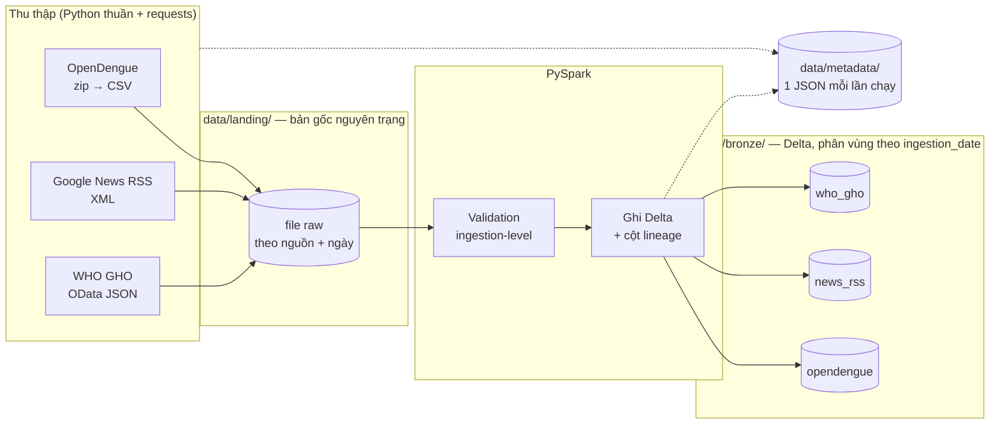

# OutbreakSignal DE - Dengue Early Warning (Bronze Ingestion)

Hệ thống thu thập và lưu trữ dữ liệu cảnh báo sớm dịch sốt xuất huyết ở Đông Nam Á.
Nhóm Microwave - AIO 2026, Module 4 (*Data Sources and Data Ingestion using PySpark*).

## Chạy nhanh

Yêu cầu: Java 17 và Python 3.11/3.12 (Windows cần thêm winutils, xem [mục 6](#6-cài-đặt)).
Trên Windows dùng **PowerShell**, không dùng Git Bash.

```powershell
git clone https://github.com/AIVIETNAM-AIO-PhamTien/outbreak-signal-de.git ; cd outbreak-signal-de
py -3.11 -m venv .venv
.venv\Scripts\pip install -r requirements.txt
.venv\Scripts\python.exe scripts
un_batch.py        # ingest 3 nguồn: Landing → Bronze
.venv\Scripts\python.exe scripts\check_bronze.py     # đọc lại Bronze để kiểm tra
```
```bash
# Linux / macOS
python3.11 -m venv .venv && .venv/bin/pip install -r requirements.txt
.venv/bin/python scripts/run_batch.py
.venv/bin/python scripts/check_bronze.py
```

Dữ liệu sinh ra ở `data/` (gitignored, không có sẵn trong repo) - ai clone về đều tự chạy để có data.

## 1. Mục tiêu

Phát hiện sớm các khu vực có nguy cơ bùng phát sốt xuất huyết ở Đông Nam Á.

Phạm vi hiện tại dừng ở **tầng Bronze**: thu thập dữ liệu từ nhiều nguồn khác nhau, giữ
nguyên trạng, và đưa vào một data lake có cấu trúc để các bước sau xử lý tiếp.

Theo feedback của TA, scope MVP đã được thu gọn còn **2 nguồn thật**, luồng chính là
**batch ingestion → Bronze → Silver**. Kafka streaming và Gold layer chuyển thành extension.

## 2. Nguồn dữ liệu

| Nguồn | Nội dung | Định dạng | Lịch chạy | Vai trò |
|---|---|---|---|---|
| **[OpenDengue](https://opendengue.org/data.html)** | Số ca bệnh cấp quốc gia **+ cấp tỉnh** (`Spatial_extract`), SEA | CSV trong zip | 1 lần/ngày | Ground truth, lịch sử dài (1960→) |
| **[Google News RSS](https://news.google.com/rss)** | Tin tức nhắc tới dengue | XML | Mỗi 30 phút | Tín hiệu sớm, nhanh hơn số liệu chính thức |
| **[WHO GHO](https://xmart-api-public.who.int/ARBOV/V_DENGUE_GLOBAL_VALIDATED_PUBLIC)** | Số ca bệnh cấp quốc gia, kiểm chứng bởi WHO | JSON (OData) | 1 lần/ngày | Ground truth **mới hơn OpenDengue rất nhiều** |

Lý do cần News RSS: OpenDengue và WHO GHO đều chính xác nhưng có độ trễ (dù khác nhau nhiều),
còn tin tức thì nhanh nhưng không có số liệu. Kết hợp mới ra được "cảnh báo sớm" đúng nghĩa.

Lý do cần cả OpenDengue lẫn WHO GHO - hai nguồn **không thay thế nhau**: OpenDengue có lịch sử
dài hơn và phủ đủ 11/11 nước SEA; WHO GHO mới hơn rất nhiều (trễ ~5 tuần so với ~17 tháng của
OpenDengue) nhưng thiếu Philippines và Brunei. Giữ cả hai còn cho phép **phát hiện bất đồng**
giữa hai nguồn cho cùng nước/tuần - một tín hiệu chất lượng dữ liệu mà một nguồn duy nhất
không có được.


## 3. Kiến trúc

<p align="center"></p>

*Hình: luồng ingest từ nguồn → Python → `data/landing/` → PySpark → `data/bronze/`. Hình vẽ cả Singapore NEA; nguồn này đã gỡ khỏi pipeline hiện tại (xem mục 2.1).*

Sơ đồ chi tiết hơn (Mermaid):



**Lý do tách 2 bước:** Spark **không** gọi được API hay crawl web, Spark chỉ biết đọc file
có sẵn trên đĩa. Nên phải dùng Python thuần (`requests`) tải dữ liệu về `data/landing/`
trước, rồi Spark mới đọc được. Logic thu thập của từng nguồn tách hẳn khỏi phần xử lý Spark.

## 4. Nguyên tắc tầng Bronze

Bronze **giữ nguyên trạng dữ liệu nguồn**. Không đổi tên cột, không lọc, không xoá trùng,
không ép kiểu dữ liệu, không join, không suy ra trường mới.

Ví dụ - nguồn trả về:

```json
{"country": "VNM", "reporting_period": "2026-06", "confirmed_cases": 120}
```

Bronze phải giữ **y nguyên** như vậy. Việc đổi `"VNM"` → `"Vietnam"`, đổi tên
`confirmed_cases` → `cases`, hay parse `"2026-06"` thành ngày, đều là việc của **Silver**.

Thứ duy nhất Bronze được phép thêm là 4 cột truy vết:

| Cột | Ý nghĩa |
|---|---|
| `_source` | Tên nguồn |
| `_ingested_at` | Thời điểm nạp (ISO-8601 UTC) |
| `_source_file` | File raw trong landing mà dòng này đến từ đó |
| `ingestion_date` | Cột phân vùng, dạng `YYYY-MM-DD` |

**Hai bản dữ liệu, hai vai trò:**

- `data/landing/` - bản **gốc byte-for-byte**, không bao giờ bị sửa. Đây là source of truth.
- `data/bronze/` - bản **Delta** để Spark query được, giữ nguyên nội dung + 4 cột trên.

Tách hai cái vì Bronze cần query được, mà nguyên tắc "giữ nguyên trạng nguồn" cũng phải có
chỗ để thoả mãn.

### 4.1 Ngoại lệ: lọc phạm vi cho OpenDengue

`ingestion/opendengue.py` **lọc dòng** trước khi ghi Bronze - điều này trông như vi phạm
"không lọc" ở trên. Đây là ngoại lệ có chủ đích, áp dụng đúng một chỗ, lý do:

OpenDengue dùng **`Spatial_extract`** (không phải `National_extract`) để có dữ liệu cấp
tỉnh - `National_extract` chỉ có cấp quốc gia (`adm_1_name`/`adm_2_name` luôn là chuỗi
`"NA"`, xác nhận bằng EDA). Vì dự án sẽ làm tầng Silver hướng tới "khoanh vùng nguy cơ",
Bronze phải giữ cấp tỉnh ngay từ đầu - Silver không thể suy ngược dữ liệu tỉnh từ dữ liệu
đã gộp cấp quốc gia.

Nhưng `Spatial_extract` là **2.821.799 dòng toàn cầu** (~55MB nén), trong khi phạm vi dự
án chỉ là 11 nước Đông Nam Á - chiếm **2,5%** dữ liệu gốc. Giữ nguyên 97,5% dữ liệu sẽ
không bao giờ được dùng là chi phí thật (dung lượng, thời gian ingest, thời gian mọi truy
vấn Silver sau này), không phải lý thuyết.

**Ranh giới đặt ra:**

- `data/landing/` giữ **100%** file CSV gốc, không đụng đến - đúng nguyên tắc source of truth.
- `data/bronze/` chỉ giữ phần **trong phạm vi SEA** (`adm_0_name` khớp danh sách 11 nước
  trong `configs/sources.yaml`, khoá `filter_countries`).
- Việc lọc là chọn **dòng nào được thu thập vào kho**, không sửa **giá trị** của dòng nào
  còn lại - không đổi tên, không chuẩn hoá, không ép kiểu. Về bản chất gần với việc chọn
  tham số nào khi gọi API (ví dụ `$filter` của `who_gho`) hơn là một phép biến đổi nghiệp vụ.

Kết quả thật (2026-09-29): `2.821.799 → 70.557 dòng` sau lọc, gồm cả `Admin0` (quốc gia,
4.841 dòng) lẫn `Admin1`/`Admin2` (tỉnh/huyện, 65.716 dòng, 329 tỉnh phân biệt).

## 5. Cấu trúc thư mục

```
.
├── configs/
│   └── sources.yaml              # mọi endpoint / lịch chạy / bật-tắt nguồn
├── ingestion/
│   ├── common/
│   │   ├── spark_session.py      # SparkSession + Delta, dùng chung mọi job
│   │   ├── config.py             # đọc sources.yaml
│   │   ├── paths.py              # landing / bronze / metadata + mốc thời gian
│   │   ├── logging.py            # log ra console + logs/ingestion_<ngày>.log
│   │   ├── metadata.py           # bản ghi metadata mỗi lần chạy
│   │   ├── validation.py         # kiểm tra mức ingestion
│   │   └── bronze.py             # ghi Delta + cột lineage
│   ├── opendengue.py             # nguồn MVP 1 (Spatial_extract, lọc SEA)
│   ├── news_rss.py               # nguồn MVP 2
│   └── who_gho.py                # nguồn bổ sung — ground truth mới hơn OpenDengue
├── scripts/
│   ├── run_batch.py              # chạy batch — điểm vào chính
│   ├── check_bronze.py           # đọc lại Bronze để kiểm tra
│   └── smoke_test.py             # kiểm tra Spark + Delta + Java
├── spikes/                       # script test nhanh từng nguồn (giai đoạn khảo sát)
├── notebooks/
├── tests/
├── assets/                       # ảnh dùng chung cho README / report
├── docs/
│   ├── bronze-layer-report.md    # report kỹ thuật tầng Bronze
│   └── handout-silver-layer.md   # bàn giao cho người làm Silver
├── data/                         # gitignored — tự sinh khi chạy
│   ├── landing/<nguồn>/<ngày>/
│   ├── bronze/<nguồn>/ingestion_date=<ngày>/
│   └── metadata/<nguồn>/ingestion_date=<ngày>/*.json
├── logs/                         # gitignored
└── .hadoop/bin/                  # gitignored, chỉ Windows — xem Bước 3
```

## 6. Cài đặt

| Thành phần | Phiên bản | Ghi chú |
|---|---|---|
| Java | OpenJDK **17** | PySpark cần JRE kể cả khi chạy local mode |
| Python | **3.11** hoặc 3.12 | xem [Lưu ý về phiên bản](#lưu-ý-về-phiên-bản) |
| pyspark | **3.5.9** | bản cũ hơn crash trên Windows — xem Lưu ý |
| winutils | chỉ **Windows** | xem Bước 3 |

> ⚠️ **Trên Windows: dùng PowerShell, KHÔNG dùng Git Bash.** Git Bash trộn lẫn dấu gạch
> xuôi/ngược khi truyền `PATH` sang JVM, khiến Spark báo `UnsatisfiedLinkError:
> NativeIO$Windows.access0` rất khó hiểu. Cùng một đoạn code chạy lỗi trong Git Bash nhưng
> chạy tốt trong PowerShell.

### Bước 1 — Java 17

```powershell
java -version          # phải ra 17.x
winget install Microsoft.OpenJDK.17   # nếu chưa có (Windows)
```
```bash
sudo apt install openjdk-17-jdk       # Ubuntu/Debian
brew install openjdk@17               # macOS
```

### Bước 2 — Virtual environment

```powershell
# Windows
py -3.11 -m venv .venv
.venv\Scripts\pip install -r requirements.txt
```
```bash
# Linux / macOS
python3.11 -m venv .venv
.venv/bin/pip install -r requirements.txt
```

### Bước 3 — winutils (CHỈ Windows)

> **Linux / macOS: bỏ qua bước này.**

Spark trên Windows cần `winutils.exe` + `hadoop.dll` để thao tác quyền file — **kể cả khi
chỉ ghi ra ổ đĩa local**. Thiếu chúng sẽ gặp `HADOOP_HOME and hadoop.home.dir are unset`.
Hai file này tồn tại vì Windows không có tương đương POSIX cho `chmod`/`chown`.

```powershell
New-Item -ItemType Directory -Force .hadoop\bin | Out-Null
$base = "https://raw.githubusercontent.com/cdarlint/winutils/master/hadoop-3.3.6/bin"
Invoke-WebRequest "$base/winutils.exe" -OutFile ".hadoop\bin\winutils.exe"
Invoke-WebRequest "$base/hadoop.dll"   -OutFile ".hadoop\bin\hadoop.dll"
```

Không cần set `HADOOP_HOME` thủ công — `ingestion/common/spark_session.py` tự trỏ vào
`.hadoop/` khi khởi tạo SparkSession.

Dùng bản **hadoop-3.3.6**. Bản 3.3.5 đòi thêm Visual C++ 2010 Redistributable
(`exitCode=-1073741515`) nên tránh. Spark 3.5 đi kèm Hadoop 3.3.4 nhưng `cdarlint` không có
đúng 3.3.4; 3.3.6 cùng nhánh minor nên chạy được.

> `.hadoop/` bị gitignore có chủ đích: đây là binary do bên thứ ba build, không nên phân
> phối lại kèm source code. Apache chưa phát hành bản build Windows chính thức
> ([HADOOP-18135](https://issues.apache.org/jira/browse/HADOOP-18135) nhắm tới Hadoop 3.5.0,
> chưa ra).

### Bước 4 — Kiểm tra cài đặt

```powershell
$env:PYTHONPATH = (Get-Location).Path
.venv\Scripts\python.exe scripts\smoke_test.py
```
```bash
PYTHONPATH=$(pwd) .venv/bin/python scripts/smoke_test.py
```

Thành công khi thấy bảng 3 dòng `ok` và dòng `Smoke test OK`.

## 7. Chạy từng nguồn

```powershell
$env:PYTHONPATH = (Get-Location).Path

.venv\Scripts\python.exe scripts\run_batch.py --source opendengue
.venv\Scripts\python.exe scripts\run_batch.py --source news_rss
.venv\Scripts\python.exe scripts\run_batch.py --source who_gho
```

Chạy nhiều nguồn trong một lệnh: lặp lại `--source`.

Muốn tắt hẳn một nguồn thì sửa `enabled: false` trong `configs/sources.yaml`, **không sửa code**.

## 8. Chạy toàn bộ

```powershell
.venv\Scripts\python.exe scripts\run_batch.py
```

Kết quả (chạy thật ngày 2026-09-29):

```
============================================================
TONG KET INGESTION
============================================================
  opendengue  SUCCESS  70,557 dong
  news_rss    SUCCESS  131 dong
  who_gho     SUCCESS  1,232 dong
  gdelt       SKIPPED  Bi rate-limit (HTTP 429) tu mang test, nghi do IP dung chung bi chan san.
============================================================
```

**Mỗi nguồn chạy độc lập.** Một nguồn chết không kéo theo nguồn khác, và dữ liệu nguồn đã
nạp thành công **không bị xoá**. Exit code là 1 nếu có nguồn `FAILED` (`SKIPPED` không tính
là lỗi).

### Lên lịch tự động (Windows Task Scheduler)

| Task | Lệnh | Tần suất |
|---|---|---|
| News | `run_batch.py --source news_rss` | 30 phút |
| OpenDengue | `run_batch.py --source opendengue` | 1 lần/ngày |
| WHO GHO | `run_batch.py --source who_gho` | 1 lần/ngày |

Không dùng Airflow cho MVP — cài và học tốn nhiều thời gian nhưng không thêm giá trị cho
phạm vi hiện tại.

## 9. Kết quả Bronze mong đợi

```powershell
.venv\Scripts\python.exe scripts\check_bronze.py
```

| Nguồn | Số dòng | Số cột | Cột gốc được giữ nguyên |
|---|---|---|---|
| opendengue | 70.557 (đã lọc SEA) | 20 | `adm_0_name`, `adm_1_name`, `adm_2_name`, `ISO_A0`, `calendar_start_date`, `dengue_total`, … |
| news_rss | ~65 / lần fetch | 9 | `title`, `link`, `pubDate`, `source`, `description` |
| who_gho | 1.232 (đã lọc SEA, 9/11 nước) | 20 | `COUNTRY`, `ISO3`, `START_DATE`, `CASES`, `WHO_REGION`, … |

Số cột = cột gốc + 4 cột truy vết ở [mục 4](#4-nguyên-tắc-tầng-bronze).

**opendengue dùng Spatial_extract, không phải National_extract.** Lý do và số liệu chi tiết
xem [mục 4.1](#41-ngoại-lệ-lọc-phạm-vi-cho-opendengue). File gốc có 2.821.799 dòng toàn cầu;
sau khi lọc còn lại xuống 70.557 dòng cho 11 nước SEA — bao gồm cả cấp quốc gia (`Admin0`,
4.841 dòng) lẫn cấp tỉnh/huyện (`Admin1`/`Admin2`, 65.716 dòng, 329 tỉnh phân biệt).

### Idempotency — chọn cách ghi đè phân vùng ngày

Mỗi lần chạy, phân vùng của ngày được **dựng lại đầy đủ** từ toàn bộ file raw trong landing
của ngày đó, rồi ghi đè bằng `replaceWhere`. Các ngày khác không bị động đến.

Hệ quả: chạy lại bước nạp bao nhiêu lần cũng ra cùng kết quả, **không bao giờ nối thêm bản
sao**. Riêng nguồn tin tức, mỗi lần *fetch mới* là một quan sát riêng nên số dòng tăng —
đó là chủ ý, không phải lỗi trùng lặp. Việc gộp bài trùng là của Silver.

## 10. Cấu trúc metadata

Mỗi lần chạy — **thành công hay thất bại** — đều để lại một file
`data/metadata/<nguồn>/ingestion_date=<ngày>/<run_id>.json`:

```json
{
  "source": "opendengue",
  "source_type": "file_download",
  "source_format": "csv",
  "source_url": "https://github.com/OpenDengue/master-repo/raw/main/data/releases/V1.3/Spatial_extract_V1_3.zip",
  "ingestion_date": "2026-09-29",
  "ingestion_timestamp": "2026-09-29T04:26:10.428169+00:00",
  "run_id": "20260929T042610Z",
  "ingestion_mode": "batch",
  "status": "success",
  "record_count": 70557,
  "raw_files": [{"path": "...", "bytes": 54687820, "sha256": "..."}],
  "bytes_downloaded": 54687820,
  "source_version": "V1.3",
  "duration_seconds": 35.56,
  "error_message": null
}
```

Metadata mô tả **thao tác ingestion**, không phải schema nghiệp vụ của dữ liệu. Nó khác với
các cột `_source` / `_ingested_at` / `_source_file` trong bảng Bronze — đó là lineage ở mức
**từng dòng**. Cần cả hai.

## 11. Hạn chế đã biết về truy cập nguồn

| Nguồn | Trạng thái | Chi tiết |
|---|---|---|
| **GDELT DOC 2.0** | Bị chặn | `HTTP 429` xác nhận lại 3 lần (29/9/2026), kể cả khi giãn 20s và xin 5 bản ghi/1 ngày — không phải lỗi gọi dồn dập, có vẻ là chặn IP mạng dùng chung. Giữ `spikes/test_gdelt_news.py` để thử lại từ mạng cá nhân. Đã thay bằng Google News RSS. |
| **WHO GHO** | Đã tích hợp, phủ 9/11 nước | Chạy thật 29/9/2026: `1.232 dòng`, dữ liệu tới tuần 24/08/2026 (mới hơn OpenDengue rất nhiều — OpenDengue trễ ~17 tháng, WHO GHO trễ ~5 tuần). **Thiếu Philippines, Brunei** — đã kiểm tra kỹ, nguồn thực sự không có dữ liệu, không phải lỗi filter. Phát hiện thêm: `(ISO3, START_DATE, DATE_TYPE)` **không phải khoá duy nhất** — 35/1.232 dòng trùng khoá này, cần tìm thêm cột phân biệt (khả năng có chiều dữ liệu khác chưa profile tới) trước khi dùng làm khoá join ở Silver. |
| **ProMED** | Không làm | Không có cơ chế truy cập công khai phù hợp trong thời gian còn lại. Không triển khai để tránh scrape endpoint không được phép. |
| **HealthMap** | Không làm | Như trên. Không tạo implementation giả, không bypass authentication, không scrape API không công bố. |
| **Google News RSS** | Hạn chế nội dung | Không có trường quốc gia hay địa điểm nào. Suy ra quốc gia từ tiêu đề chỉ đạt ~22% (đo bằng keyword matching) — là việc của Silver, và là giới hạn trên của độ chính xác, cần nói rõ trong report. |
| **OpenDengue** | Không phải live data | Phát hành theo version (V1.3 ra 27/05/2025, số liệu chỉ tới 04/2025). Kiểm tra bản mới 1 lần/ngày là đủ. Dùng `Spatial_extract` (không phải `National_extract`) để có cấp tỉnh — xem [mục 4.1](#41-ngoại-lệ-lọc-phạm-vi-cho-opendengue). |
| **Singapore NEA** | Đã gỡ khỏi pipeline | Từng có ingestion hoàn chỉnh (toạ độ thật, cấp cụm phố) nhưng chỉ phủ 1/11 nước SEA — không scale cho mục tiêu "phát hiện sớm cho các nước SEA". Lịch sử: xem git log. |

## 12. Chạy test

```powershell
$env:PYTHONPATH = (Get-Location).Path
.venv\Scripts\python.exe -m pytest                        # toàn bộ
.venv\Scripts\python.exe -m pytest -m "not integration"    # bỏ qua test cần JVM
```

| Nhóm test | Nội dung |
|---|---|
| `test_config.py` | Đọc YAML, trộn defaults, bật/tắt nguồn, báo lỗi rõ ràng |
| `test_paths.py` | Sinh đường dẫn, mốc thời gian, tách thư mục theo nguồn |
| `test_metadata.py` | Đủ trường bắt buộc, checksum, duration, lần chạy thất bại |
| `test_validation.py` | Nguồn không với tới được, file rỗng, file thiếu, landing rỗng |
| `test_who_gho.py` | Hàm dựng OData `$filter` cho WHO GHO |
| `test_integration_bronze.py` | OpenDengue: **nguồn → ingestion → Bronze → metadata** (kể cả filter SEA), chạy thật Spark + Delta |
| `test_integration_who_gho.py` | WHO GHO: cùng chuỗi, chạy thật Spark + Delta |

## 13. Ngoài phạm vi hiện tại

Chưa triển khai, và **không** thêm vào nếu không có yêu cầu rõ ràng:

Silver layer · Gold layer · schema chung · chuẩn hoá / làm sạch dữ liệu · dedup · NLP ·
trích xuất thực thể · feature engineering · machine learning · dự đoán bùng phát · chấm
điểm rủi ro · dashboard · Kafka · streaming · Snowflake · dbt · Dagster · Airflow · LLM ·
vector database · data warehouse.

Silver là bước kế tiếp theo feedback TA, nhưng **chưa có dòng code nào** trong repo này.

## Lưu ý về phiên bản

**`pyspark` phải là 3.5.9.** Các bản 3.5.x trước đó dính
[SPARK-53759](https://issues.apache.org/jira/browse/SPARK-53759): `createDataFrame()` làm
Python worker crash. Bug này **chỉ xảy ra trên Windows** + Python 3.12/3.13 + local mode.

**Cảnh báo vô hại trong log:**

- *Windows* — cuối mỗi job: `ERROR ShutdownHookManager: Exception while deleting Spark temp
  dir: ... antlr4-runtime.jar`. Do Windows còn giữ lock file `.jar` lúc JVM tắt. Không ảnh
  hưởng dữ liệu — cứ nhìn exit code và bảng tổng kết.
- *Linux / macOS* — đầu mỗi job: `WARN NativeCodeLoader: Unable to load native-hadoop
  library`. Hadoop có thư viện native tuỳ chọn; không có thì Spark dùng bản Java thuần.
