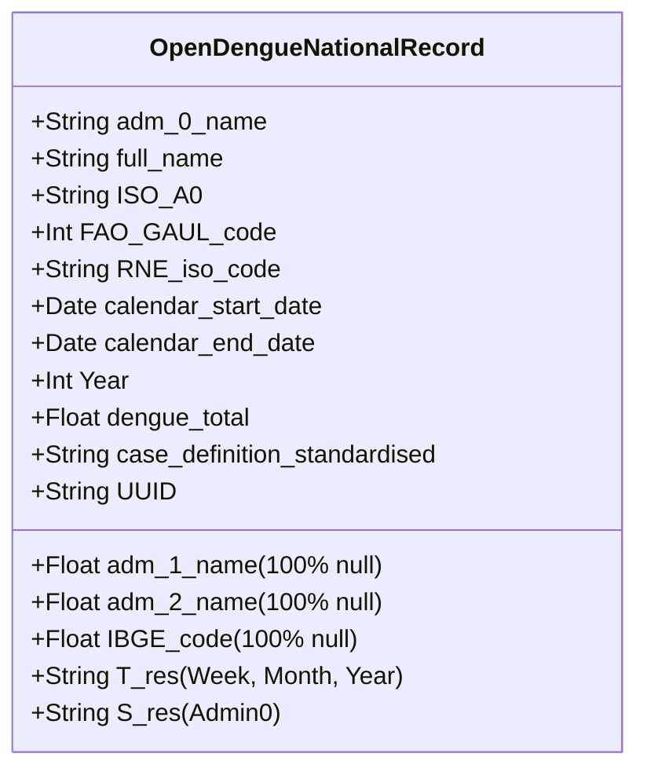
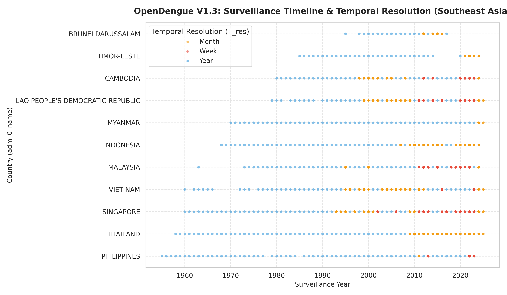
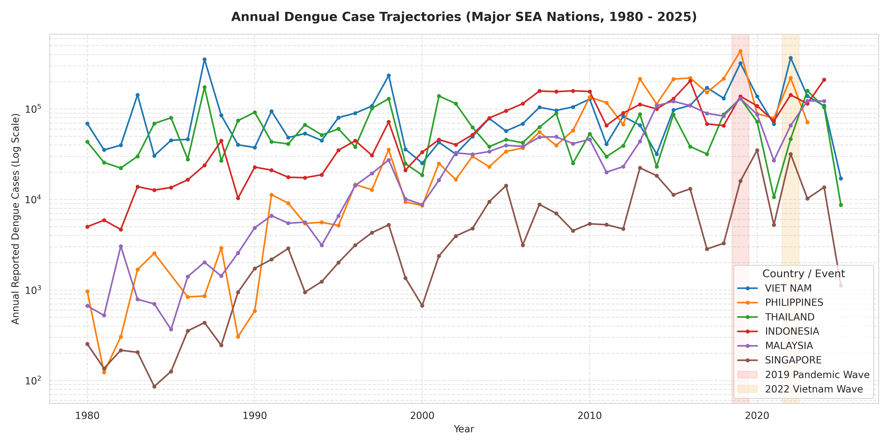
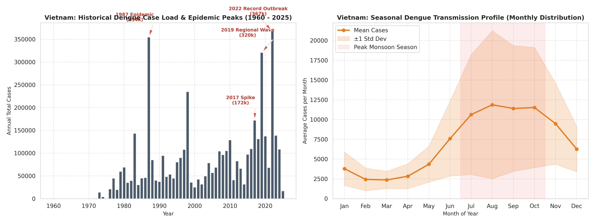
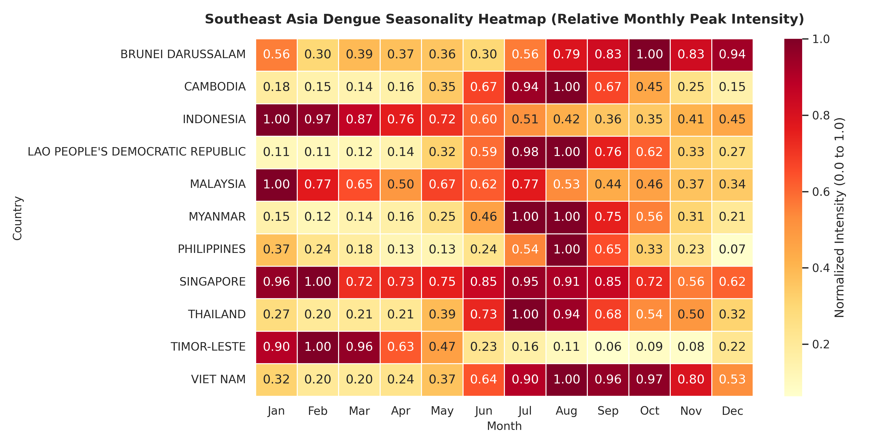
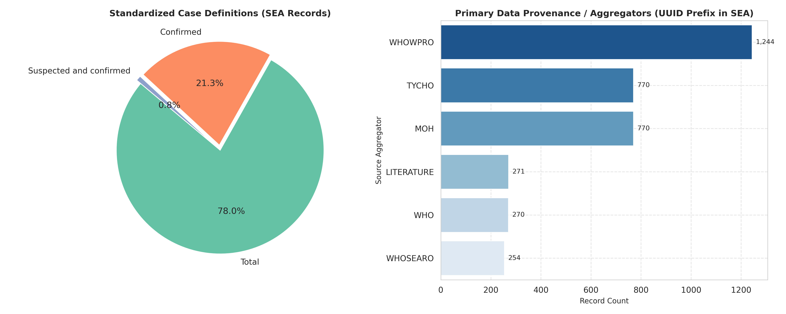
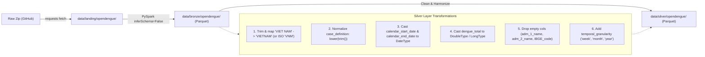

# Exploratory Data Analysis (EDA): OpenDengue Dataset (National Extract V1.3)

**Project:** OutbreakSignal DE — Nhóm Microwave (AIO 2026, Module 4: Data Sources & Ingestion)  
**Target:** Dengue Surveillance in Southeast Asia (Ground-Truth Disease Records)  
**Dataset Reference:** OpenDengue V1.3 (`National_extract_V1_3.csv`)

---

## Executive Summary

OpenDengue provides global, curated longitudinal epidemiological data compiled from WHO, Project Tycho, peer-reviewed literature, and national Ministries of Health. In this EDA, we analyze the **National Extract V1.3** to evaluate its suitability for the Bronze and Silver ingestion layers of OutbreakSignal DE.

### High-Level Statistics
| Metric | Global Dataset | Southeast Asia (SEA) Subset |
|---|---|---|
| **Total Rows** | 29,873 | 3,579 |
| **Total Columns** | 16 | 16 |
| **Countries Covered** | 129 nations | 11 nations (all ASEAN + Timor-Leste) |
| **Temporal Span** | 1924 – 2025 (101 years) | 1955 – 2025 (70 years) |
| **Cumulative Recorded Cases** | 76,817,163 | 16,988,963 (~22.1% of global cases) |
| **Spatial Resolution (`S_res`)** | 100% `Admin0` (National) | 100% `Admin0` (National) |
| **Temporal Resolutions (`T_res`)** | Week (77.8%), Year (11.7%), Month (10.5%) | Week (59.4%), Month (27.7%), Year (12.9%) |

---

## 1. Schema & Data Structure

The dataset contains 16 columns categorized into 4 semantic groups:

### Column Profiling
* **Geographical Identifiers:**
  * `adm_0_name`: Canonical country name (e.g., `VIET NAM`, `THAILAND`, `PHILIPPINES`).
  * `full_name`: Fully qualified administrative name.
  * `ISO_A0`: ISO 3166-1 alpha-3 code (e.g., `VNM`, `THA`, `PHL`).
  * `FAO_GAUL_code` & `RNE_iso_code`: Interoperability codes for UN FAO and regional mapping.
  * `adm_1_name`, `adm_2_name`, `IBGE_code`: **100% Null (29,873 / 29,873 missing)**. Expected because this is the national-level aggregate extract (`S_res == Admin0`).
* **Temporal Attributes:**
  * `calendar_start_date` & `calendar_end_date`: ISO format (`YYYY-MM-DD`).
  * `Year`: Integer reporting year (1924 to 2025).
  * `T_res`: Resolution of the reporting interval (`Week`, `Month`, `Year`).
* **Epidemiological Metrics:**
  * `dengue_total`: Float count of cases recorded in the given interval.
  * `case_definition_standardised`: Categorical classification of the diagnostic criteria.
  * `S_res`: Spatial resolution (`Admin0` across entire file).
  * `UUID`: Cryptographic/curation identifier referencing source paper, WHO bulletin, or Tycho stream.

---

## 2. Critical Data Engineering Traps & Quality Findings

During our deep audit, we discovered four subtle traps that directly impact the PySpark pipeline design:

> [!WARNING]
> ### Trap 1: The `"VIET NAM"` Whitespace Trap
> In OpenDengue, Vietnam is officially recorded as **`"VIET NAM"`** (with a space), following UN/FAO conventions, **NOT** `"VIETNAM"`.
> 
> A standard lookup `adm_0_name == "VIETNAM"` silently filters out all 317 Vietnam rows, underreporting the region by 4.56 million cases!
> * **Fix for Silver Layer:** Standardize country strings using `trim()`, uppercase, and regex/alias mapping (`replace("VIET NAM", "VIETNAM")` or mapping to ISO `VNM`).

> [!IMPORTANT]
> ### Trap 2: Mixed Temporal Resolutions (`T_res`) in a Single Column
> The column `dengue_total` contains **three heterogeneous time grains**:
> - Some rows are 1-week counts (`T_res == 'Week'`)
> - Some rows are 1-month counts (`T_res == 'Month'`)
> - Some rows are 1-year annual totals (`T_res == 'Year'`)
> 
> **Key Finding on Overlap:** Within any given country and calendar year, OpenDengue uses **non-overlapping resolutions** (i.e. a country in year $Y$ has either 52 weekly records, 12 monthly records, OR 1 annual record; never both).  
> **Danger:** Direct time-series modeling without resampling will compare a single week (~1,000 cases) to an entire annual total (~150,000 cases). Downstream Silver transformations must explicitly group by `(adm_0_name, Year)` for annual trends or resample to monthly grains.

> [!NOTE]
> ### Trap 3: Case Definition Standardization Quirks
> The field `case_definition_standardised` contains:
> - `Total` (23,592)
> - `Suspected` (3,295)
> - `Confirmed` (1,307)
> - `Probable and confirmed` (1,074)
> - `Suspected and confirmed` (399)
> - `Probable` (103)
> - `confirmed` (103) $\leftarrow$ **Case mismatch:** lowercase `"confirmed"` vs capitalized `"Confirmed"`.
> 
> In Southeast Asia, 97.4% of records are categorized as `Total`. In Silver, apply `lower(trim(case_definition_standardised))` to harmonize the labels.

> [!TIP]
> ### Trap 4: Zero Duplicate Records
> We audited duplicates on composite key `(adm_0_name, calendar_start_date, calendar_end_date)`.
> - **Global Duplicates:** `0`
> - **SEA Duplicates:** `0`
> This confirms high curation quality: OpenDengue does not have conflicting reports for the same date interval in the National extract.

---

## 3. Southeast Asia (SEA) Regional Coverage

OpenDengue provides continuous coverage for all 11 nations in Southeast Asia:

| Country (`adm_0_name`) | ISO | Total Records | Surveillance Range | `Week` Rows | `Month` Rows | `Year` Rows | Cumulative Cases |
|---|---|---|---|---|---|---|---|
| **VIET NAM** | `VNM` | 317 | 1960 – 2025 | 93 | 183 | 41 | 4,565,891 |
| **INDONESIA** | `IDN` | 220 | 1968 – 2024 | 0 | 178 | 42 | 3,212,124 |
| **THAILAND** | `THA` | 246 | 1958 – 2025 | 0 | 195 | 51 | 3,068,213 |
| **PHILIPPINES** | `PHL` | 224 | 1955 – 2023 | 149 | 12 | 63 | 2,822,549 |
| **MALAYSIA** | `MYS` | 545 | 1963 – 2024 | 468 | 36 | 41 | 1,667,648 |
| **CAMBODIA** | `KHM` | 449 | 1980 – 2024 | 311 | 108 | 30 | 511,978 |
| **MYANMAR** | `MMR` | 68 | 1970 – 2025 | 0 | 14 | 54 | 488,835 |
| **LAO PDR** | `LAO` | 575 | 1979 – 2025 | 415 | 135 | 25 | 354,180 |
| **SINGAPORE** | `SGP` | 793 | 1960 – 2025 | 627 | 123 | 43 | 292,770 |
| **TIMOR-LESTE** | `TLS` | 77 | 1985 – 2024 | 0 | 46 | 31 | 16,265 |
| **BRUNEI** | `BRN` | 65 | 1995 – 2017 | 0 | 48 | 17 | 4,005 |
| **TOTAL** | — | **3,579** | **1955 – 2025** | **2,063** | **978** | **538** | **16,988,963** |

---

## 4. Epidemiological Trends & Historic Outbreaks

By aggregating each country's records by `(adm_0_name, Year)`, we reconstruct the continuous annual caseload across the region from 1980 to 2025.

### Key Outbreak Waves in Southeast Asia:
1. **The 2019 Pan-Regional Dengue Emergency:**
   - A super-epidemic swept across Southeast Asia:
     * **Philippines:** 437,563 cases (highest recorded in national history, national dengue epidemic declared).
     * **Vietnam:** 320,702 cases.
     * **Malaysia:** 130,101 cases.
     * **Thailand:** 131,157 cases.
2. **The 2022 Vietnam Wave:**
   - Vietnam suffered an all-time record outbreak of **367,729 cases**, surpassing the 2019 peak.
3. **The 1987 Historical Epidemic:**
   - Severe dengue hemorrhagic fever epidemic across mainland SEA: Vietnam recorded **354,517 cases** and Thailand recorded **174,285 cases**.

---

## 5. Vietnam In-Depth Outbreak & Seasonality Analysis

Vietnam represents the single largest cumulative case burden in Southeast Asia within OpenDengue (over 4.56 million recorded cases).

### Seasonal Dynamics in Vietnam
From the monthly surveillance subset (`T_res == 'Month'`), dengue incidence demonstrates strong seasonal periodicity:
- **Baseline / Low Season (January – April):** Average monthly incidence remains stable between **2,300 and 3,700 cases/month**.
- **Onset / Acceleration (May – June):** Cases rapidly climb from **4,358 (May)** to **7,590 (June)** as the Southwest monsoon sets in.
- **Peak Epidemic Season (July – October):** Monthly caseload stays above **10,500 – 11,872 cases/month**, peaking in August/October.
- **Tapering (November – December):** Gradual decrease to **9,476 (Nov)** and **6,261 (Dec)**.

> [!TIP]
> **Outbreak Early-Warning Rule for OutbreakSignal DE:**  
> A reported monthly case count in Vietnam exceeding **5,000 cases before June** or a weekly count exceeding **1,500 cases in Q1/Q2** indicates an abnormal early outbreak wave, which should trigger high-priority alerts when correlated with spikes in dengue-related Google News articles.

---

## 6. Comparative Regional Seasonality

The transmission season depends heavily on geography and latitude across Southeast Asia:

* **Northern Tropical Belt (Vietnam, Cambodia, Laos, Thailand):**
  * Peak intensity occurs between **June and October** (coninciding with the rainy/monsoon season).
* **Southern Hemisphere Tropical Belt (Timor-Leste):**
  * Peak transmission is **inverted**: highest cases occur between **December and March** (Southern tropical rainy season), while July to October are minimal.

---

## 7. Data Provenance & Case Definitions

Understanding data provenance ensures that downstream data lake layers trace data lineage back to trustworthy primary sources.

### Primary Curators (UUID Prefixes):
1. **TYCHO (Project Tycho):** Provides historical digitized surveillance (1960s – 2010s).
2. **WHOWPRO (WHO Western Pacific Regional Office):** Supplies weekly and monthly official surveillance bulletins for Vietnam, Cambodia, Laos, Philippines, Singapore, Malaysia.
3. **WHO (Global Health Observatory):** Annual historical statistics.
4. **LITERATURE:** Curated peer-reviewed epidemiological research papers filling historical gaps.

---

## 8. Recommendations for Pipeline Implementation (Bronze & Silver)

Based on these findings, here is the architectural specification for the OutbreakSignal DE pipeline:

1. **Bronze Layer:**
   - Adhere strictly to the bronze invariant: Keep `inferSchema=False`, do not drop null columns, do not normalize country names. Store with partition `ingest_date=YYYY-MM-DD`.
2. **Silver Layer:**
   - Create a clean standardized table with:
     * Standardized country: `country_name` (`VIETNAM`), `country_iso` (`VNM`).
     * Cast dates to `DateType` and case counts to `IntegerType` / `DoubleType`.
     * Cleaned `case_definition` in lowercase.
     * Drop the 100% null columns (`adm_1_name`, `adm_2_name`, `IBGE_code`).
     * Expose both the raw interval records and a monthly-resampled view for easy correlation with news signals.

---

## 9. Deliverables in Codebase

| File | Description |
|---|---|
| [`src/eda_opendengue.py`](file:///Users/iamqazolp/Documents/Projects/microwave/outbreak-signal-de/src/eda_opendengue.py) | Standalone automated Python EDA pipeline script. |
| [`notebooks/eda_opendengue.ipynb`](file:///Users/iamqazolp/Documents/Projects/microwave/outbreak-signal-de/notebooks/eda_opendengue.ipynb) | Interactive 17-cell Jupyter Notebook for exploratory execution. |
| [`spikes/test_opendengue.py`](file:///Users/iamqazolp/Documents/Projects/microwave/outbreak-signal-de/spikes/test_opendengue.py#L29-L44) | Updated spike test including `'VIET NAM'` country filter. |
| [`docs/images/*.png`](file:///Users/iamqazolp/Documents/Projects/microwave/outbreak-signal-de/docs/images) | 5 publication-ready 300-DPI visualization figures. |
